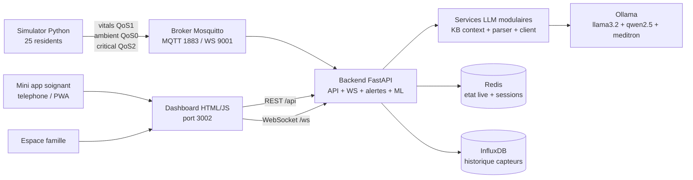
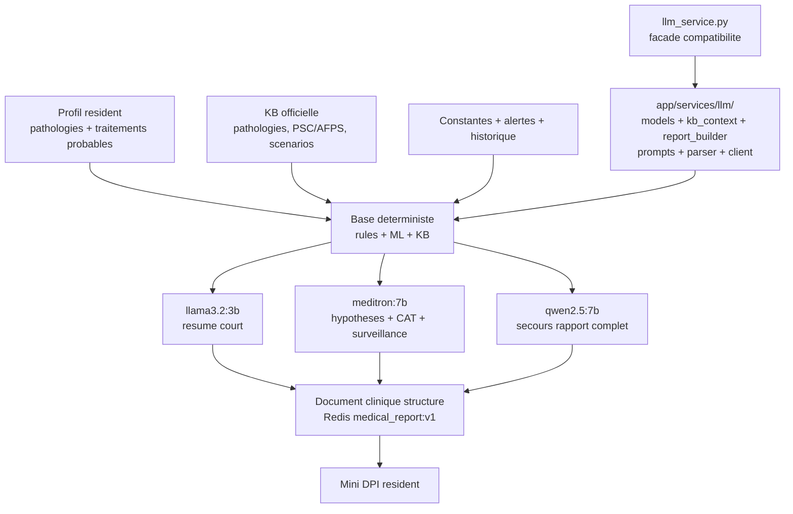
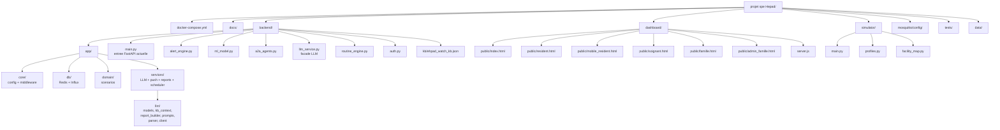
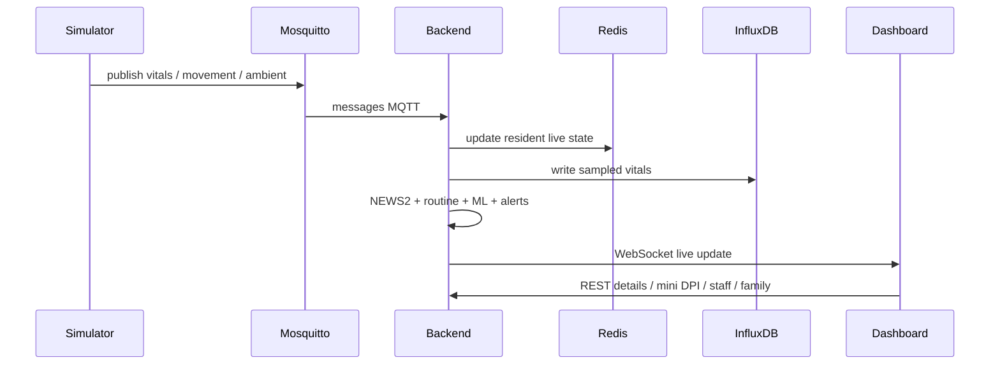
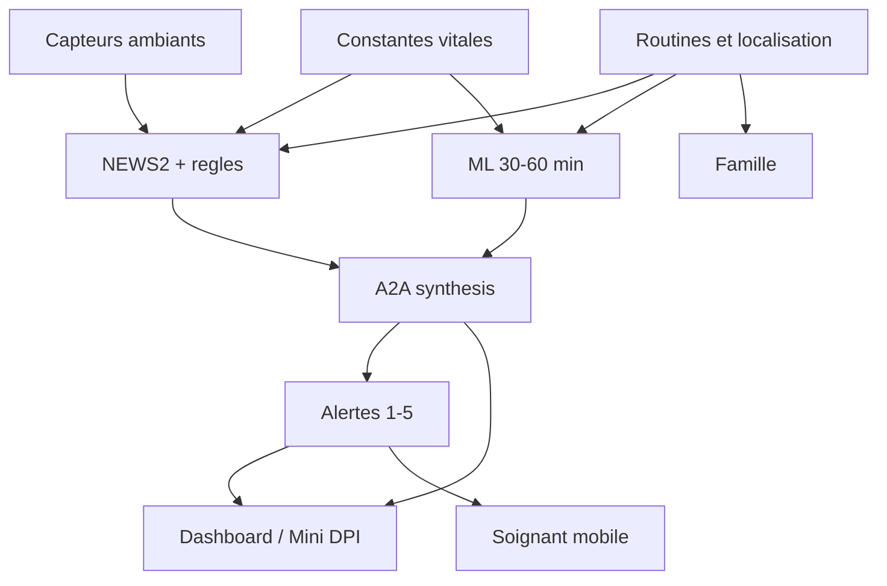

# EHPAD Monitor - Detection et prediction de malaise

Projet MBA1 Epitech de monitoring EHPAD connecte.

Le projet simule un etablissement EHPAD avec 25 residents, des constantes vitales,
des capteurs ambiants, un flux MQTT temps reel, un moteur d'alertes 5 niveaux,
une prediction ML 30-60 minutes, une interface soignant, une mini app mobile,
un portail famille et une couche de scalabilite observable.

Pipeline principal:

```text
simulation -> MQTT -> backend -> Redis / InfluxDB -> dashboard -> soignant / famille / notifications
```

Le systeme vise une assistance clinique prudente et explicable. Il ne remplace
pas un diagnostic medical autonome.

Ce projet est un prototype avance de surveillance EHPAD temps reel. Il demontre
une chaine technique complete, mais ne constitue pas un dispositif medical
certifie ni un outil de decision clinique autonome. Les alertes, le ML et le LLM
servent a prioriser et contextualiser la vigilance; la decision finale reste
humaine.

## Sommaire

- [Demarrage rapide](#demarrage-rapide)
- [Acces de demonstration](#acces-de-demonstration)
- [Mini app soignant sur telephone](#mini-app-soignant-sur-telephone)
- [Objectif du projet](#objectif-du-projet)
- [Approche hybride](#approche-hybride)
- [Stack technique](#stack-technique)
- [Architecture globale](#architecture-globale)
- [Flux temps reel](#flux-temps-reel)
- [Fonctionnement clinique](#fonctionnement-clinique)
- [Organisation des fonctions](#organisation-des-fonctions)
- [Alertes 5 niveaux](#alertes-5-niveaux)
- [ML et prediction](#ml-et-prediction)
- [Espace famille](#espace-famille)
- [Scalabilite](#scalabilite)
- [Endpoints principaux](#endpoints-principaux)
- [Commandes utiles](#commandes-utiles)
- [Demo conseillee](#demo-conseillee)
- [Tests et verification](#tests-et-verification)
- [Organisation des fichiers](#organisation-des-fichiers)
- [Securite](#securite)
- [Limites actuelles](#limites-actuelles)

## Demarrage rapide

Commande recommandee pour Windows, macOS et Linux:

```bash
docker compose up --build -d
```

Commande a lancer depuis le dossier racine du projet:

```bash
cd <dossier-du-projet>
docker compose up --build -d
docker compose ps
```

Cette commande:

- construit et demarre toute la stack;
- lance MQTT, Redis, InfluxDB, simulateur, backend, worker LLM et dashboard;
- fonctionne directement dans PowerShell sur Windows;
- ne demande pas de build React/Vite: le dashboard actuel est en HTML/JS statique.

LLM local pour la demo IA:

```bash
ollama serve
```

En demonstration, Ollama tourne sur Windows en local et le backend Docker s'y
connecte via `http://host.docker.internal:11434`. C'est le mode utilise pour les
rapports IA complets. Si Ollama est eteint ou trop lent, le backend ne plante pas:
il retombe sur un rapport local base sur les regles et la KB, mais la sortie est
moins riche qu'avec le routage LLM.

## Prerequis

- Docker Desktop ou Docker Engine avec `docker compose`.
- Ports disponibles: `3002`, `3443`, `8001`, `1883`, `9001`, `6379`, `8086`.
- Pour la demo LLM: Ollama installe et lance localement sur Windows avec `llama3.2:3b`, `qwen2.5:7b` et `meditron:7b`.
- Pour tester la mini app sur telephone: PC et telephone sur le meme reseau Wi-Fi.
- Pour tester les push mobiles reels: HTTPS local avec certificats dans `dashboard/certs/`.

## Scripts de secours

La commande principale reste:

```bash
docker compose up --build -d
```

Des scripts sont disponibles si vous voulez un demarrage assiste avec attente du
backend et du dashboard.

Windows PowerShell:

```powershell
.\start-demo.ps1
```

Windows double-clic:

```bat
start-demo.cmd
```

macOS / Linux / Git Bash:

```bash
NO_BROWSER=1 ./start.sh
```

Ces scripts:

- verifient Docker;
- lancent la stack;
- attendent `http://localhost:8001/health`;
- attendent `http://localhost:3002`;
- affichent les URLs utiles.

## URLs utiles

- Dashboard principal: `http://localhost:3002`
- Espace soignant: `http://localhost:3002/soignant`
- Mini DPI resident: `http://localhost:3002/resident/R005?from=dashboard&return=/`
- Mini app intervention: `http://localhost:3002/mobile/resident/R005`
- Espace famille: `http://localhost:3002/famille.html`
- Admin familles: `http://localhost:3002/admin_famille.html`
- Backend API: `http://localhost:8001`
- Swagger: `http://localhost:8001/docs`
- InfluxDB: `http://localhost:8086`
- MQTT: `localhost:1883`
- MQTT WebSocket: `localhost:9001`

## Acces de demonstration

| Espace | Identifiant | Mot de passe / token | Role |
|---|---|---|---|
| Soignant A | `soignant_A` | voir `.env` (`STAFF_DEMO_PASSWORD`) | secteur affecte |
| Soignant B | `soignant_B` | voir `.env` (`STAFF_DEMO_PASSWORD`) | secteur affecte |
| Soignant C | `soignant_C` | voir `.env` (`STAFF_DEMO_PASSWORD`) | secteur affecte |
| Chef de garde | `chef_garde` | voir `.env` (`STAFF_DEMO_PASSWORD`) | acces privilegie |
| Direction | `direction` | voir `.env` (`STAFF_DEMO_PASSWORD`) | supervision |
| Famille Edith Piaf | `piaf` | voir `.env` | proche R005 |
| Famille Marie Curie | `curie` | voir `.env` | proche R001 |
| Famille Dalida | `dalida` | voir `.env` | proche R019 |
| Admin familles | token admin | voir `.env` (`FAMILLE_ADMIN_TOKEN`) | gestion comptes famille |

La liste complete des comptes famille est dans `docs/comptes_famille_demo.md`.

> **Demo locale** : copier `.env.example` en `.env` et renseigner les valeurs avant `docker compose up`.

`.env.example` documente les variables necessaires avec des valeurs de type
`change-me-*`. Le fichier `.env` local n'est pas versionne et doit contenir les
secrets reels de demonstration. Ces valeurs ne doivent jamais etre reutilisees
en production.

## Activation des fonctions

Les variables principales sont documentees dans `.env.example`.

| Variable | Valeur demo | Role |
|---|---|---|
| `NUM_RESIDENTS` | `25` | nombre de residents simules |
| `STAFF_DEMO_PASSWORD` | défini dans `.env` | mot de passe demo personnel |
| `FAMILLE_ADMIN_TOKEN` | défini dans `.env` | token admin familles |
| `REDIS_PASSWORD` | `change-me-redis-long-random` | protection Redis |
| `INFLUX_TOKEN` | `change-me-influx-token` | token InfluxDB |
| `OLLAMA_HOST` | `http://host.docker.internal:11434` | URL Ollama depuis Docker |
| `OLLAMA_MODEL` | `meditron:7b` | modele LLM local |
| `LLM_ROUTING_ENABLED` | `true` | active le routage multi-modeles LLM |
| `LLM_FAST_MODEL` | `llama3.2:3b` | synthese courte soignant/famille |
| `LLM_CLINICAL_MODEL` | `meditron:7b` | hypotheses, CAT, surveillance et sources KB |
| `LLM_MEDICAL_MODEL` | `qwen2.5:7b` | secours rapport medical si le modele clinique echoue |
| `LLM_DAILY_AUTO_ENABLED` | `false` backend, `true` worker | generation auto rapports LLM |
| `MQTT_USERNAME` / `MQTT_PASSWORD` | comptes service | authentification MQTT |
| `HTTPS_REQUIRED` | `false` | force HTTPS hors localhost si active |
| `ALLOWED_ORIGINS` | localhost dashboard | CORS API |
| `VAPID_PUBLIC_KEY` / `VAPID_PRIVATE_KEY` | vide ou demo compose | Web Push navigateur |

Utilisation conseillee:

```bash
cp .env.example .env
docker compose up --build -d
```

Pour une soutenance locale, les valeurs par defaut de `docker-compose.yml`
suffisent. Pour un rendu propre, remplacez les secrets demo si le projet est
publie.

## Mini app soignant sur telephone

La mini app soignant sert a recevoir les alertes, ouvrir une fiche intervention
mobile et prendre en charge un resident depuis un telephone.

### Mode simple, sans notifications push

Ce mode suffit pour montrer l'interface mobile au jury.

1. Demarrer la stack:

```bash
docker compose up --build -d
```

2. Trouver l'adresse IP du PC sur le reseau Wi-Fi:

```powershell
ipconfig
```

Prendre l'adresse IPv4 de la carte Wi-Fi, par exemple `192.168.1.85`.

3. Connecter le telephone au meme Wi-Fi que le PC.

4. Ouvrir dans le navigateur du telephone:

```text
http://192.168.1.85:3002/soignant
```

5. Se connecter avec:

```text
chef_garde / mot de passe defini dans .env
```

6. Ouvrir une fiche mobile:

```text
http://192.168.1.85:3002/mobile/resident/R005
```

### Mode PWA installee sur l'ecran d'accueil

La page soignant contient:

- un manifest PWA: `dashboard/public/manifest.webmanifest`;
- un service worker: `dashboard/public/sw.js`;
- une page mobile: `dashboard/public/mobile_resident.html`.

Sur Android Chrome:

1. Ouvrir `http://IP_DU_PC:3002/soignant`.
2. Se connecter.
3. Menu Chrome -> `Ajouter a l'ecran d'accueil`.
4. L'application apparait comme `EPicare`.

Sur iPhone Safari:

1. Ouvrir `http://IP_DU_PC:3002/soignant`.
2. Se connecter.
3. Bouton partager -> `Sur l'ecran d'accueil`.

### Mode push complet

Les notifications push navigateur exigent un contexte securise. Pour un
telephone, il faut donc utiliser HTTPS:

```text
https://IP_DU_PC:3443/soignant
```

Le serveur dashboard demarre HTTPS sur le port `3443` si des certificats
locaux sont presents dans `dashboard/certs/`.

Demarche:

1. Generer ou recuperer des certificats locaux compatibles avec l'IP du PC.
2. Les placer dans `dashboard/certs/`.
3. Installer l'autorite locale sur le telephone si necessaire.
4. Ouvrir `https://IP_DU_PC:3443/soignant`.
5. Se connecter avec un compte soignant.
6. Cliquer sur `Activer les alertes push`.
7. Cliquer sur `Envoyer un test push`.

Important:

- `http://IP_DU_PC:3002` suffit pour la demo mobile.
- `https://IP_DU_PC:3443` est necessaire pour les push reels.
- les Web Push reels demandent aussi `WEBPUSH_ENABLED=true` et une paire de
  cles VAPID (`VAPID_PUBLIC_KEY`, `VAPID_PRIVATE_KEY`).
- Les certificats locaux et cles privees ne doivent pas etre commites dans Git.

En Docker local, le projet laisse `WEBPUSH_ENABLED=false` tant que les cles
VAPID ne sont pas configurees. Dans ce mode, on teste bien les routes backend,
le ciblage des soignants et l'audit, mais aucune notification systeme reelle
n'est envoyee par le navigateur.

## Objectif du projet

- simuler un EHPAD multi-residents;
- publier les donnees capteurs en MQTT;
- detecter les risques immediats et les alertes critiques;
- predire un risque d'aggravation a 30-60 minutes;
- prioriser les interventions soignantes;
- fournir une vue famille non medicale;
- demontrer la scalabilite et la robustesse Docker.

## Approche hybride

La logique reste volontairement hybride:

- `Regles cliniques`: seuils vitaux, chute, SOS, NEWS2, anti-bruit.
- `Contexte comportemental`: routine, zone, repas, sommeil, inactivite.
- `Capteurs ambiants`: porte, lit, sol, radar, PIR, salle de bain.
- `ML`: score predictif 30-60 minutes.
- `A2A`: orchestration realtime + ML + comportement + alertes + transmission.
- `LLM`: synthese optionnelle via Ollama, avec fallback local.

## Stack technique

- Python 3.11 pour backend et simulateur.
- FastAPI pour API REST et WebSocket.
- Paho MQTT pour publication / consommation capteurs.
- Mosquitto pour le broker MQTT.
- Redis pour etat courant, sessions, cache, audit et predictions.
- InfluxDB pour historique de constantes.
- Scikit-learn pour le modele `GradientBoostingClassifier`.
- HTML / CSS / JavaScript statique pour le dashboard.
- Three.js pour la vue 3D de l'EHPAD.
- Express pour servir le dashboard et proxyfier `/api`.
- Ollama + routage `llama3.2:3b` / `qwen2.5:7b` / `meditron:7b` pour les rapports LLM optionnels.
- Docker Compose pour lancer l'ensemble.

## Architecture globale



## Architecture LLM et Mini DPI

Le LLM est route par tache. Il ne decide pas seul: le backend construit d'abord
une base deterministe avec regles, ML, alertes, historique et KB. Les modeles
locaux enrichissent ensuite cette base.



Ce qui est affiche dans le rapport:

- `Base deterministe`: garantit un rapport minimal meme sans LLM.
- `Synthese rapide / llama3.2:3b`: resume soignant, vigilance courte, message famille.
- `Analyse clinique KB / meditron:7b`: hypotheses differentielles, conduite a tenir, surveillance, sources.
- `Rapport medical de secours / qwen2.5:7b`: secours si le modele clinique echoue ou repond hors format.

Le document stocke suit une structure inspiree FHIR `DiagnosticReport` +
`Composition`: metadata, conclusion, sections, sources et tracabilite. Il est
conserve dans Redis par resident/date et rattache au Mini DPI.

Depuis le refactor de pre-rendu, `backend/llm_service.py` est une facade courte
de compatibilite. Le code LLM est decoupe dans `backend/app/services/llm/`:

- `models.py`: modele `LLMReport`;
- `kb_context.py`: contexte KB/RAG, sources et filtrage;
- `report_builder.py`: rapport deterministe, fallback et niveau de risque;
- `prompts.py`: prompts Ollama;
- `parser.py`: parsing JSON, normalisation et fusion;
- `client.py`: appels Ollama, jobs Redis et execution synchrone/asynchrone.

Lecture rapide:

- le simulateur publie les etats residents et capteurs;
- le backend consomme MQTT, calcule alertes/ML et stocke l'etat;
- Redis garde le live et les sessions;
- InfluxDB garde l'historique;
- le dashboard interroge l'API et recoit le live en WebSocket;
- la mini app telephone utilise la page soignant + service worker;
- l'espace famille utilise un token limite a un resident.

## Lecture de l'architecture

- Le simulateur genere les constantes et evenements de vie a partir de profils
  residents, routines, chambres et scenarios.
- Il publie les donnees sur MQTT avec differents niveaux de QoS selon la criticite.
- Le backend consomme les messages MQTT, enrichit l'etat resident, calcule le
  score NEWS2, detecte les alertes, ecrit l'historique et diffuse le live.
- Redis conserve l'etat courant, les sessions, les audits et les caches.
- InfluxDB conserve les series temporelles de constantes.
- Le dashboard affiche le temps reel, les alertes, le plan, le Mini DPI, les
  transmissions, le personnel et la scalabilite.
- La mini app soignant reutilise le meme backend mais avec une interface mobile
  orientee intervention.
- L'espace famille expose uniquement une vue non medicale du proche.
- Le ML et l'A2A apportent une aide prospective, sans prendre de decision
  medicale autonome.

## Schema structurel du projet



## Flux temps reel



## Schema fonctionnel



Lecture fonctionnelle:

- les constantes alimentent a la fois les regles et le ML;
- les capteurs ambiants confirment ou contextualisent les evenements;
- les routines evitent de confondre un comportement normal et un signal faible;
- l'A2A transforme les scores en priorite et transmission lisible;
- le dashboard et l'app soignant affichent les donnees medicales;
- la famille ne voit qu'un carnet de vie filtre.

## Fonctionnement clinique

L'interface distingue plusieurs blocs:

- `Dashboard global`: 25 residents, constantes, alertes et priorisation.
- `Mini DPI`: profil, pathologies, capteurs, risque, historique et transmission.
- `Transmission soignants`: SAED/CDAR immediat, genere par regles + KB + ML,
  separe du compte rendu IA.
- `Compte rendu clinique IA`: document Meditron/RAG genere ensuite a la demande,
  avec preuves, hypotheses, conduite a tenir, surveillance, sources et tracabilite LLM.
- `Plan / capteurs`: localisation 2D/3D, chambres, zones, capteurs actifs.
- `Personnel`: soignants, affectations, charge, notifications et audit.
- `Famille`: carnet de vie sans constantes medicales.
- `ML/A2A`: prediction 30/60 minutes et synthese explicable.
- `Scalabilite`: MQTT, Redis, InfluxDB, WebSocket et objectifs de charge.

Important:

- le simulateur ne change pas selon une validation medicale humaine;
- le LLM n'est pas reentraine localement;
- les rapports LLM sont un compte rendu clinique enrichi apres transmission, pas un avis medical officiel;
- l'entrainement ML reste separe du moteur d'alerte live;
- le Mini DPI dashboard utilise un rapport frais pour eviter un cache ancien.
- les antecedents du patient, traitements probables et scenarios preferes sont
  relies a la KB pour contextualiser la conduite a tenir.

## Organisation des fonctions

Le backend est organise par responsabilites.

### Ingestion temps reel

- recoit les messages MQTT;
- met a jour l'etat resident;
- stocke les constantes;
- diffuse au WebSocket.

Fichiers principaux:

- `backend/main.py`
- `simulator/main.py`
- `backend/ws_manager.py`

### Regles et alertes

- calcule les niveaux 1 a 5;
- integre constantes, mouvement, capteurs, routines et NEWS2;
- gere escalade, acquittement, prise en charge et resolution.

Fichiers principaux:

- `backend/alert_engine.py`
- `backend/main.py`

### Prediction ML

- construit les features vitales et tendances;
- calcule `risk_30min` et `risk_60min`;
- expose les metriques du modele.

Fichier principal:

- `backend/ml_model.py`

### Pipeline A2A

- combine realtime, ML, comportement, alertes et transmission;
- produit des actions soignantes et points de vigilance.

Fichier principal:

- `backend/a2a_agents.py`

### Mini DPI et transmissions

- agrege profil, constantes, capteurs, historique 30 jours, risque et actions;
- fournit une vue resident exploitable par le dashboard.
- genere une transmission soignante structuree en SAED/CDAR, disponible sans LLM;
- reference le dernier rapport clinique structure genere par le LLM;
- separe la transmission operationnelle du compte rendu clinique IA Meditron;
- expose les antecedents relies a la KB: pathologies, traitements probables,
  scenarios patients, seuils adaptes et conduite a tenir.

Endpoints:

- `/api/reports/daily/{date}/{resident_id}`
- `/api/residents/{resident_id}/dpi`
- `/api/residents/{resident_id}/medical-reports/latest`
- `/api/residents/{resident_id}/medical-reports/{date}`

### Soignants et notifications

- gere sessions personnel;
- controle les acces DPI;
- suit les affectations;
- trace vues, prises en charge, acquittements et push.

Fichiers principaux:

- `backend/auth.py`
- `dashboard/public/soignant.html`
- `dashboard/public/mobile_resident.html`

### Famille

- compte individuel par famille;
- token limite a un resident;
- vue volontairement non medicale.

Fichiers principaux:

- `backend/auth.py`
- `dashboard/public/famille.html`
- `dashboard/public/admin_famille.html`

### Plan et capteurs

- affiche les chambres et zones sur un plan 2D;
- affiche une vue 3D Three.js de l'etablissement;
- relie chaque resident a une position;
- affiche capteurs actifs, qualite, batterie et dernier signal.

Fichiers principaux:

- `dashboard/public/index.html`
- `dashboard/public/resident.html`
- `simulator/facility_map.py`

### Scalabilite et exploitation

- mesure le debit MQTT global et sur 60 secondes;
- expose les compteurs vitaux / ambiants;
- estime la pression InfluxDB et WebSocket;
- donne des recommandations pour tester 50 residents.

Endpoint:

- `/api/ops/scalability`

### Benchmark de charge pour preuve jury

Le projet contient un script de benchmark MQTT/API:

- `backend/benchmark_scalability.py`

Objectif:

- prouver la cible sujet `20 residents x 6 constantes = 120 messages/s`;
- tester l'extension `50 residents x 6 constantes = 300 messages/s`;
- mesurer la latence API p95/p99 pendant la charge;
- comparer messages envoyes et messages observes par le backend.

Preparer la stack:

```bash
docker compose up --build -d
docker compose ps
```

Test cible sujet 120 messages/s:

```bash
docker compose run --rm --no-deps backend python benchmark_scalability.py --target-mps 120 --duration-s 60 --residents 25
```

Test extension 300 messages/s:

```bash
docker compose run --rm --no-deps backend python benchmark_scalability.py --target-mps 300 --duration-s 60 --residents 50
```

Pendant le test, relever CPU/RAM Docker dans un autre terminal:

```bash
docker stats ehpad_backend ehpad_simulator ehpad_mqtt ehpad_redis ehpad_influx ehpad_dashboard
```

Champs importants dans la sortie JSON:

- `sent_messages`: messages MQTT envoyes par le benchmark;
- `backend_observed_delta_messages`: messages vus par le backend;
- `backend_observed_messages_per_second`: debit reel observe;
- `api_latency_ms.p95`: latence API p95 pendant le test;
- `backend_after.backend.state_age_max_s`: fraicheur maximale des etats residents;
- `interpretation.ok_for_jury`: indicateur rapide de validation.

Critere de validation conseille pour la soutenance:

```text
publish_errors == 0
backend_observed_delta_messages >= 90% des messages envoyes
api_latency_ms.p95 < 500 ms
state_age_max_s raisonnable apres la charge
```

Phrase jury:

```text
La scalabilite a ete verifiee par benchmark MQTT: 120 messages/s pour la cible
sujet, puis 300 messages/s pour une projection 50 residents. Le backend expose
les compteurs observes, la latence API p95/p99 et la fraicheur des etats Redis.
Le ML et le LLM restent hors boucle temps reel afin de proteger le dashboard.
```

## Alertes 5 niveaux

| Niveau | Nom | Usage | Routage |
|---|---|---|---|
| 1 | Information | signal faible / suivi dashboard | dashboard |
| 2 | Attention | anomalie a surveiller | soignant assigne |
| 3 | Alerte | intervention recommandee | soignant + son |
| 4 | Urgence | intervention rapide | tous soignants |
| 5 | Danger vital | protocole critique | tous + direction + SAMU selon protocole |

Points importants:

- les niveaux 1-3 sont limites par une politique anti-bruit;
- les alertes de routine seules ne montent pas artificiellement en danger vital;
- le niveau 5 est reserve aux signaux critiques, escalades graves ou combinaisons objectivables;
- le dashboard possede un rendu visuel specifique pour chaque niveau.

Programmation des scenarios critiques:

- malaise repas / retour repas: niveau 4, car risque de chute ou immobilite;
- chute capteur ou scenario de chute: niveau 4;
- chute confirmee + immobilite + constante aggravee: niveau 5;
- SOS et fugue hors EHPAD: niveau 4;
- lever toilettes nuit chez resident fragile: niveau 3;
- desorientation simple: niveau 3;
- desorientation avec trouble cognitif en zone sensible: niveau 4;
- sortie jardin non accompagnee: niveau 3, ou niveau 4 si trouble cognitif;
- fatigue clinique apres kine, toilette ou jardin: niveau 3 si fragilite, NEWS ou risque IA associe.

La note complete est disponible dans `docs/alert_levels_escalation.md`.

## ML et prediction

Le modele ML est une preuve de concept basee sur donnees synthetiques.

Features principales:

- frequence cardiaque;
- SpO2;
- pression arterielle systolique;
- temperature;
- inactivite;
- tendance FC;
- tendance SpO2;
- facteur age;
- facteur risque resident.

Sorties:

- `risk_30min`;
- `risk_60min`;
- tendance;
- signaux faibles;
- metriques exposees dans `/api/ml/metrics`.

Message a retenir pour le jury:

```text
Le ML montre une chaine predictive technique 30-60 minutes. Il ne constitue pas
une validation medicale reelle. En production, il faudrait des donnees EHPAD
reelles, un split temporel et une validation clinique.
```

## Separation regles / ML / LLM

### Regles

- seuils immediats;
- NEWS2;
- chute, SOS, fugue;
- escalade;
- fallback d'analyse si le LLM ne repond pas.

### ML

- apprend un risque a partir de donnees synthetiques;
- produit `risk_30min` et `risk_60min`;
- s'appuie sur `StandardScaler + GradientBoostingClassifier`;
- ne choisit pas seul le niveau final;
- ne remplace pas la decision soignante.

### LLM

- utilise un routage multi-modeles local;
- reformule une synthese clinique courte avec `llama3.2:3b`;
- construit hypotheses, CAT, surveillance et sources KB avec `meditron:7b`;
- garde `qwen2.5:7b` comme secours de rapport complet si le modele clinique echoue;
- utilise contexte resident, historique, alertes, antecedents, traitements probables et KB locale;
- stocke un document clinique structure dans le Mini DPI;
- n'est pas fine-tune par le projet;
- retombe sur un fallback local si Ollama est indisponible ou trop lent.

La sortie LLM affiche aussi la tracabilite `Qui a fait quoi`: base deterministe,
modele rapide, modele clinique et eventuel fallback medical.

## Espace famille

L'espace famille est volontairement limite.

Visible:

- nom du resident;
- avatar;
- chambre;
- etat general;
- activite;
- soignant referent;
- menu;
- programme de vie;
- dernieres activites.

Masque:

- frequence cardiaque;
- SpO2;
- pression arterielle;
- temperature;
- scores cliniques;
- alertes brutes;
- predictions ML detaillees.

## Scalabilite

Endpoint:

```text
GET /api/ops/scalability
```

Il expose:

- nombre de residents;
- debit MQTT total;
- debit MQTT sur 60 secondes;
- messages vitaux / ambiants;
- age du dernier message;
- estimation InfluxDB;
- debit WebSocket;
- frequence du pipeline de prediction;
- recommandations de montee en charge.

Objectif de demo:

- montrer que 25 residents tournent en continu;
- montrer que la cible 20 residents est depassee;
- expliquer que Redis garde le live et InfluxDB garde l'historique.

## Notifications

Le projet distingue deux niveaux de notifications.

### Notifications internes dashboard

Elles sont visibles dans l'interface web soignant:

- alertes actives et historiques;
- acquittement;
- prise en charge;
- validation / cloture;
- audit des actions soignantes.

Ces notifications internes fonctionnent en environnement Docker local.

### Notifications navigateur / Web Push

Les Web Push servent a afficher une notification systeme sur un navigateur ou
un smartphone compatible. Elles necessitent une configuration plus stricte:

- HTTPS ou contexte securise;
- cles VAPID `VAPID_PUBLIC_KEY` et `VAPID_PRIVATE_KEY`;
- `WEBPUSH_ENABLED=true`;
- permission utilisateur accordee dans le navigateur;
- service worker actif cote dashboard.

En environnement Docker local, `WEBPUSH_ENABLED=false` par defaut si les cles
VAPID ne sont pas renseignees. Les routes backend, le ciblage soignant et
l'audit sont testables, mais l'envoi reel d'une notification systeme depend de
la configuration HTTPS/VAPID du poste ou du serveur.

Point important pour la demo:

- le cadre rouge plein ecran est une alerte visuelle dans la page soignant
  ouverte;
- il disparait si l'onglet ou le navigateur est ferme, car c'est un element
  HTML/CSS;
- les Web Push sont le mecanisme prevu pour afficher une notification systeme
  sur le PC ou le telephone quand la page n'est pas au premier plan.

Validation locale Web Push:

```env
VAPID_PUBLIC_KEY=<cle_publique_vapid>
VAPID_PRIVATE_KEY=<cle_privee_vapid>
VAPID_CLAIMS_EMAIL=admin@ehpad.local
```

Ces valeurs doivent etre mises dans `.env`, jamais dans Git. Apres modification:

```bash
docker compose up -d backend dashboard
curl http://localhost:8001/api/push/config
```

Resultat attendu:

```json
{"enabled": true, "public_key": "<cle_publique_vapid>"}
```

Dans l'interface soignant: se connecter, cliquer sur `Activer les alertes push`,
accepter l'autorisation navigateur, puis utiliser `Envoyer un test push`.

Le projet supporte techniquement:

- notifications live dans l'application soignant;
- notifications navigateur via Service Worker;
- Web Push serveur si les cles VAPID sont configurees;
- audit des livraisons push.

Routes associees:

- `GET /api/push/config`
- `GET /api/push/status`
- `POST /api/push/subscribe`
- `DELETE /api/push/subscribe`
- `POST /api/push/test`
- `POST /api/push/test-all`
- `GET /api/push/delivery/{alert_id}`
- `GET /api/push/audit`

Limites importantes:

- onglet ouvert: comportement le plus fiable;
- les push reels demandent HTTPS sur telephone;
- les push reels demandent une paire de cles VAPID valide;
- un onglet ferme peut recevoir les notifications selon navigateur;
- un navigateur totalement ferme depend de l'OS, du navigateur et des reglages
  batterie;
- iOS/Safari et certains navigateurs imposent des restrictions supplementaires;
- pour la demo jury, la fiche mobile fonctionne sans push.

## LLM local

Le projet utilise Ollama localement sur Windows, pas comme service Docker. Le
backend tourne dans Docker et appelle Ollama avec:

```text
OLLAMA_HOST=http://host.docker.internal:11434
```

C'est le mode recommande pour la soutenance: les modeles sont deja installes sur
la machine, le demarrage est plus stable, et il n'y a pas de retelechargement de
modeles dans un volume Docker.

Routage utilise en pratique:

| Tache | Modele | Role |
|---|---|---|
| Synthese courte | `llama3.2:3b` | resume soignant, vigilance courte, message famille |
| Analyse clinique KB | `meditron:7b` | hypotheses differentielles, CAT, surveillance, sources |
| Rapport complet / secours medical | `qwen2.5:7b` | secours si le modele clinique echoue ou repond hors format |

Activation avant la demo:

```powershell
ollama serve
ollama list
```

Les modeles attendus sont:

```text
llama3.2:3b
qwen2.5:7b
meditron:7b
```

Installation des modeles si besoin:

```powershell
ollama pull llama3.2:3b
ollama pull qwen2.5:7b
ollama pull meditron:7b
```

Puis lancer ou relancer la stack:

```powershell
docker compose up --build -d
```

Important: il n'y a pas de service `ollama` dans le `docker-compose.yml` actuel.
La commande `docker compose up -d ollama` n'est donc pas celle a utiliser ici.
En production, Ollama pourrait etre conteneurise dans un service separe avec un
volume de modeles dedie, mais ce n'est pas le choix retenu pour la demo locale.

### Option Docker pour mise en production

Pour une mise en production ou une livraison 100% conteneurisee, Ollama peut
etre ajoute comme service Docker separe. Cette option n'est pas active dans la
demo actuelle, mais l'architecture backend est deja compatible: il suffit de
changer `OLLAMA_HOST`.

Exemple de principe:

```yaml
ollama:
  image: ollama/ollama:latest
  container_name: ehpad_ollama
  ports:
    - "11434:11434"
  volumes:
    - ollama_models:/root/.ollama
  restart: unless-stopped
```

Dans ce cas, le backend utiliserait:

```env
OLLAMA_HOST=http://ollama:11434
```

Points d'attention avant de choisir cette option:

- precharger les modeles dans le volume Docker (`llama3.2:3b`, `qwen2.5:7b`, `meditron:7b`);
- verifier les ressources CPU/RAM/GPU de la machine;
- eviter de telecharger les modeles pendant la soutenance ou au premier demarrage;
- surveiller la latence, car Docker ne rend pas les reponses plus rapides par lui-meme.

Variables utiles:

- `OLLAMA_HOST`
- `OLLAMA_MODEL`
- `LLM_ROUTING_ENABLED`
- `LLM_FAST_MODEL`
- `LLM_CLINICAL_MODEL`
- `LLM_MEDICAL_MODEL`
- `LLM_DAILY_AUTO_ENABLED`
- `LLM_DAILY_TTL_DAYS`

Le backend retombe sur un fallback local si Ollama est indisponible ou trop lent.
Ce fallback garantit que le projet reste fonctionnel, mais il ne remplace pas la
qualite d'analyse du routage LLM. Les rapports forces peuvent prendre 60 a 90
secondes selon la machine; pour une demo, il est conseille de les pre-generer
avant le passage jury.

## Services Docker

| Service | Role | Port |
|---|---|---|
| `mosquitto` | broker MQTT | `1883`, `9001` |
| `redis` | etat courant, sessions, cache | `6379` |
| `influxdb` | historique capteurs | `8086` |
| `simulator` | generation residents/capteurs | interne |
| `backend` | API, WS, ML, alertes | `8001` |
| `llm_worker` | rapports LLM quotidiens | interne |
| `dashboard` | dashboard HTML + proxy API | `3002`, `3443` |

## Endpoints principaux

| Endpoint | Description |
|---|---|
| `GET /health` | sante backend |
| `GET /api/residents` | 25 residents live |
| `GET /api/residents/{id}` | detail resident protege |
| `GET /api/residents/{id}/dpi` | mini DPI protege |
| `GET /api/reports/daily/{date}/{id}` | mini DPI frais pour dashboard |
| `GET /api/residents/{id}/medical-reports/latest` | dernier rapport clinique structure |
| `GET /api/residents/{id}/medical-reports/{date}` | rapport clinique structure date |
| `GET /api/alerts` | alertes actives + historique |
| `GET /api/alerts/config` | configuration 5 niveaux |
| `POST /api/alerts/{id}/acknowledge` | acquittement |
| `GET /api/alerts/explain/{id}` | explication alerte |
| `GET /api/a2a/predictions` | predictions 25 residents |
| `GET /api/a2a/predict/{id}` | prediction protegee resident |
| `GET /api/ml/metrics` | metriques ML |
| `GET /api/staff` | personnel et affectations |
| `POST /api/staff/login` | login soignant |
| `GET /api/famille/{id}` | vue famille protegee |
| `POST /api/famille/login` | login famille |
| `GET /api/ops/scalability` | stats scalabilite |
| `GET /api/push/config` | configuration Web Push |
| `POST /api/push/subscribe` | inscription telephone |
| `POST /api/push/test` | test push soignant |
| `GET /api/llm/report/{id}` | rapport LLM resident |
| `GET /api/llm/daily/{date}` | statut rapports quotidiens |
| `GET /api/security/access-logs` | journal acces DPI |
| `GET /api/security/break-glass` | journal bris de glace |
| `WS /ws` | flux live dashboard |

## Endpoints techniques et audit

Ces endpoints ne sont pas des pages metier principales. Ils sont conserves pour
la soutenance, les tests, l'audit et l'exploitation technique.

| Endpoint | Usage | Statut |
|---|---|---|
| `GET /api/kb/scenarios` | verifier la KB scenarios et les conduites a tenir | outil technique |
| `GET /api/kb/scenarios/{id}` | inspecter un scenario KB precis | outil technique |
| `GET /api/kb/archetypes` | verifier les archetypes residents | outil technique |
| `GET /api/kb/residents` | verifier mapping residents -> archetypes/KB | outil technique |
| `GET /api/kb/official` | verifier les sources officielles integrees | outil technique |
| `GET /api/kb/epidor` | verifier la KB importee EPIDOR | outil technique |
| `GET /api/a2a/agents` | montrer les agents A2A disponibles | outil validation |
| `GET /api/a2a/predictions` | alimenter dashboard Validation pro | utilise dashboard |
| `GET /api/a2a/predict/{id}` | debug/prediction resident protegee | outil technique |
| `GET /api/ml/metrics` | verifier les metriques ML | outil validation |
| `POST /api/llm/report/{id}/start` | generation LLM asynchrone | utilise dashboard/Mini DPI |
| `GET /api/llm/result/{job_id}` | recuperation resultat LLM async | utilise dashboard/Mini DPI |
| `GET /api/llm/audit` | audit des appels LLM | outil audit |
| `GET /api/push/audit` | audit des notifications push | outil audit |
| `GET /api/notifications/audit` | audit actions soignants | utilise soignant/audit |
| `GET /api/simulator/config` | configuration simulateur | utilise configuration/demo |
| `PUT /api/simulator/config/residents/{id}` | modification profil demo | utilise configuration/demo |
| `POST /api/simulator/config/history/generate` | regeneration historique dossier patient | outil demo |
| `GET /api/residents/{id}/dossier/history` | historique 12 mois dossier patient | utilise dashboard |
| `GET /api/summary` | synthese legacy/debug | compatibilite ancien dashboard |

Decision actuelle:

- ne pas supprimer ces endpoints avant la soutenance;
- les presenter comme couche de validation technique;
- utiliser `/api/llm/report/{id}/start` et `/api/llm/result/{job_id}` pour les
  generations longues: le dashboard affiche un statut puis recupere le resultat;
- documenter que les endpoints KB/ML/A2A servent a prouver l'explicabilite.

## Commandes utiles

Commande principale:

```bash
docker compose up --build -d
```

Support:

```bash
docker compose ps
docker compose logs --tail=50 backend
docker compose logs --tail=50 simulator
docker compose down
```

Scripts:

```powershell
.\start-demo.ps1
```

```bash
NO_BROWSER=1 ./start.sh
```

Tests:

```bash
py -m pip install -r backend/requirements-dev.txt
py -m pytest tests -q
py -m py_compile .\backend\main.py
py -m py_compile .\simulator\main.py
```

Verification API:

```powershell
Invoke-RestMethod http://localhost:8001/health
Invoke-RestMethod http://localhost:8001/api/residents
Invoke-RestMethod http://localhost:8001/api/alerts/config
Invoke-RestMethod http://localhost:8001/api/ml/metrics
Invoke-RestMethod http://localhost:8001/api/ops/scalability
```

Validation Docker depuis zero:

```bash
docker compose down
docker compose up --build -d
docker compose ps
```

## Demo conseillee

1. Demarrer Docker avec `docker compose up --build -d`.
2. Ouvrir le dashboard principal.
3. Montrer les 25 residents et les constantes live.
4. Montrer les alertes actives et la configuration 5 niveaux.
5. Ouvrir un resident et son Mini DPI.
6. Montrer le plan 2D / 3D et les capteurs.
7. Ouvrir l'espace soignant avec `chef_garde` et le mot de passe defini dans `.env`.
8. Montrer la mini app telephone ou la fiche mobile.
9. Ouvrir l'espace famille avec un compte famille de demonstration defini dans `.env` ou dans la procedure locale.
10. Montrer ML/A2A et scalabilite.

Guide detaille:

- `docs/demo.md`

## Correspondance cahier des charges

| Demande ecole | Realisation projet | Statut |
|---|---|---|
| 20 residents minimum | 25 residents simules | OK |
| Capteurs vitaux | FC, SpO2, PA, temperature, FR | OK |
| Capteurs ambiants | porte, lit, PIR, radar, sol, SDB | OK |
| MQTT | Mosquitto + QoS 0/1/2 | OK |
| Dashboard multi-residents | grille 25 residents + detail | OK |
| Alertes 5 niveaux | information a danger vital | OK |
| Docker Compose | stack complete avec healthchecks | OK |
| Prediction 30-60 min | ML + A2A | Bonus |
| Securisation MQTT | auth + ACL + ports localhost | Bonus |
| Rapport clinique structure | LLM route + document Mini DPI | Bonus |
| Historique / routines | Redis + InfluxDB + routine engine | Bonus |
| Personnel / escalade | app soignant, affectations, audits | Bonus |
| Famille | portail famille filtre | Bonus |
| Plan / capteurs | SVG 2D + Three.js + qualite capteurs | Bonus |
| Scalabilite | endpoint MQTT/Redis/WebSocket | Bonus |

## Tests et verification

Le projet contient plus de 120 fonctions de test Python. Le test des 25 comptes
famille est parametre, donc Pytest collecte actuellement 148 cas.

Derniere validation pre-rendu:

- `148 passed`;
- backend Docker reconstruit et `healthy`;
- `GET /health` retourne `ok` avec 25 residents;
- `GET /api/ml/metrics` retourne les metriques ML, dont `sensitivity`;
- `pip-audit -r requirements.txt` ne trouve plus de vulnerabilite connue;
- Trivy cible sur `backend/requirements.txt`: 0 HIGH / CRITICAL;
- Bandit: 0 High / 0 Medium, uniquement des Low a traiter hors blocage;
- `python -m py_compile llm_service.py app/services/llm/*.py` passe dans le conteneur backend.

Scripts de support conserves:

- `backend/benchmark_scalability.py`: benchmark charge MQTT/API pour preuve jury.
- `backend/test_history_before_after.py`: outil manuel de comparaison historique
  avant/apres injection; non lance en production.

Verification minimale avant rendu:

```bash
docker compose up --build -d
docker compose ps
py -m pip install -r backend/requirements-dev.txt
py -m pytest tests -q
```

En cas de test depuis Docker, installer temporairement les outils de test dans
le conteneur backend ou utiliser un environnement Python 3.11/3.12 local. Le
Python 3.14 n'est pas recommande pour ce projet car certaines dependances
scientifiques n'ont pas de wheel compatible avec les versions epinglees.

Verification fonctionnelle:

- `GET /health` doit repondre `ok`;
- `/api/residents` doit retourner 25 residents;
- `/api/alerts/config` doit retourner 5 niveaux;
- `/api/ml/metrics` doit retourner les metriques;
- `/api/ops/scalability` doit retourner les stats MQTT.

Verification securite pre-rendu:

```bash
py -m pip install -r backend/requirements-dev.txt
cd backend && bandit -r . -x app/services/llm/__pycache__ && pip-audit -r requirements.txt
cd ..
docker run --rm -v "${PWD}:/repo" zricethezav/gitleaks:latest detect --source=/repo --verbose --no-git
docker run --rm -v "${PWD}:/repo" aquasec/trivy:latest fs /repo --severity CRITICAL,HIGH --no-progress
```

CI GitHub Actions:

Le workflow `.github/workflows/ci.yml` lance automatiquement les controles
principaux sur `master`, `main` et les pull requests:

- installation des dependances backend et simulateur;
- demarrage de la stack Docker Compose;
- attente de `http://localhost:8001/health`;
- execution de `pytest`;
- audit npm du dashboard;
- validation `docker compose config`.

Notes securite:

- `dashboard/certs/` contient des certificats locaux de developpement, ignorees
  par Git; Gitleaks/Trivy les signalent si le dossier existe localement.
- `fastapi`, `pydantic` et `starlette` ont ete alignes sur des versions corrigees
  pour supprimer le signal CVE Starlette remonte par `pip-audit`.
- `python-multipart` a ete mis a jour en `0.0.26`.
- `scikit-learn` a ete mis a jour en `1.5.0`.
- `hashlib.md5` a ete remplace par `sha256` dans l'injecteur d'historique.

## Organisation des fichiers

```text
projet spe Hepad/
|-- backend/
|   |-- app/
|   |   |-- api/
|   |   |   `-- routers/
|   |   |       |-- a2a_ml.py
|   |   |       |-- alerts.py
|   |   |       |-- famille.py
|   |   |       |-- health.py
|   |   |       |-- kb.py
|   |   |       |-- live.py
|   |   |       |-- llm.py
|   |   |       |-- project.py
|   |   |       |-- push.py
|   |   |       |-- reports.py
|   |   |       |-- simulator.py
|   |   |       `-- staff.py
|   |   |-- core/
|   |   |   |-- config.py
|   |   |   `-- middleware.py
|   |   |-- db/
|   |   |   |-- redis_client.py
|   |   |   `-- influx_client.py
|   |   |-- domain/
|   |       |-- readiness.py
|   |       |-- residents.py
|   |       |-- scenario_kb_mapping.py
|   |       `-- scenarios.py
|   |   `-- services/
|   |       |-- llm/
|   |       |   |-- models.py
|   |       |   |-- kb_context.py
|   |       |   |-- report_builder.py
|   |       |   |-- prompts.py
|   |       |   |-- parser.py
|   |       |   `-- client.py
|   |       |-- llm_report_service.py
|   |       |-- patient_files_service.py
|   |       |-- push_service.py
|   |       |-- scalability_service.py
|   |       `-- scheduler_service.py
|   |-- main.py
|   |-- alert_engine.py
|   |-- ml_model.py
|   |-- a2a_agents.py
|   |-- auth.py
|   |-- llm_service.py
|   |-- routine_engine.py
|   |-- resident_profiles.py
|   |-- kb_loader.py
|   |-- kb/
|   |-- requirements.txt
|   `-- requirements-dev.txt
|-- simulator/
|   |-- main.py
|   |-- scenario_scheduler.py
|   |-- profiles.py
|   |-- facility_map.py
|   `-- requirements.txt
|-- dashboard/
|   |-- public/
|   |   |-- index.html
|   |   |-- resident.html
|   |   |-- mobile_resident.html
|   |   |-- soignant.html
|   |   |-- famille.html
|   |   |-- admin_famille.html
|   |   |-- simulateur_config.html
|   |   |-- manifest.webmanifest
|   |   `-- sw.js
|   |-- server.js
|   |-- package.json
|   `-- Dockerfile
|-- mosquitto/
|   `-- config/
|       |-- mosquitto.conf
|       |-- acl
|       `-- passwd
|-- docs/
|-- tests/
|-- data/
|-- docker-compose.yml
`-- README.md
```

## Role des dossiers principaux

- `backend`: logique centrale du projet.
- `backend/app/api`: routers FastAPI extraits progressivement de `main.py`.
- `backend/app/core`: configuration et middleware FastAPI transverses.
- `backend/app/db`: clients Redis et InfluxDB centralises.
- `backend/app/domain`: constantes metier partagees, comme les scenarios.
- `backend/app/services`: services applicatifs extraits, dont LLM, push,
  fichiers patient, scalabilite et scheduler.
- `simulator`: generation des constantes et capteurs.
- `simulator/scenario_scheduler.py`: ponderation temporelle et clinique des 31 scenarios.
- `dashboard`: interface HTML, mini app soignant, portail famille.
- `docs`: architecture, audits, comptes demo, guide oral et note `alert_levels_escalation.md`.
- `tests`: tests automatises.
- `data`: donnees generees localement.
- `mosquitto`: configuration du broker MQTT, comptes et ACL.

## Fichiers importants

Backend:

- `backend/main.py`: entree FastAPI actuelle, routes API et orchestration legacy.
- `backend/app/api/routers/health.py`: route racine et healthcheck Docker.
- `backend/app/api/routers/project.py`: readiness jury et plan de vie/scenarios.
- `backend/app/core/config.py`: variables d'environnement centralisees.
- `backend/app/core/middleware.py`: CORS, HTTPS local, entetes securite, charset UTF-8.
- `backend/app/db/redis_client.py`: client Redis unique.
- `backend/app/db/influx_client.py`: client InfluxDB et write API.
- `backend/app/domain/readiness.py`: matrice de validation projet et plan de vie.
- `backend/app/domain/residents.py`: archetypes resident et classification.
- `backend/app/domain/scenario_kb_mapping.py`: mapping simulateur vers KB clinique et conduite a tenir.
- `backend/app/domain/scenarios.py`: catalogue des scenarios de simulation.
- `backend/alert_engine.py`: moteur d'alertes 5 niveaux.
- `backend/ml_model.py`: entrainement et prediction ML.
- `backend/a2a_agents.py`: pipeline agentique.
- `backend/auth.py`: sessions famille et personnel.
- `backend/llm_service.py`: facade de compatibilite LLM.
- `backend/app/services/llm/`: modules LLM decoupes par responsabilite
  (`models`, `kb_context`, `report_builder`, `prompts`, `parser`, `client`).
- `backend/kb/official_elderly_complications_kb.json`: KB officielle pathologies,
  complications, premiers secours et conduite a tenir.

Note architecture:

Le backend reste volontairement un monolithe FastAPI pour la demo Epitech et le
deploiement Docker Compose. Il est maintenant organise comme un monolithe
modulaire: `main.py` garde encore une partie de l'orchestration legacy, tandis
que la configuration, le middleware, les routes API, les services LLM/push,
les services patient et les constantes metier sont sortis dans `backend/app/`.
L'etape production suivante consiste a finir de vider `main.py` vers
`app/api/routers/` et `app/services/`, puis a ajouter une CI GitHub Actions.

Dashboard:

- `dashboard/public/index.html`: dashboard principal.
- `dashboard/public/resident.html`: Mini DPI complet.
- `dashboard/public/mobile_resident.html`: fiche intervention mobile.
- `dashboard/public/soignant.html`: app soignant / PWA / push.
- `dashboard/public/famille.html`: portail famille.
- `dashboard/server.js`: serveur statique + proxy API.

Simulateur:

- `simulator/main.py`: generation et publication MQTT.
- `simulator/profiles.py`: residents, chambres, capteurs, profils.
- `simulator/facility_map.py`: plan, zones et trajets.

## Securite

- Sessions soignant et famille stockees dans Redis.
- Acces DPI protege pour les pages soignant.
- Acces dashboard au Mini DPI sans prompt, via rapport resident non modifiant.
- Vue famille limitee: pas de constantes vitales ni scores cliniques.
- Logs d'acces, notifications, bris de glace et actions d'alerte.
- Redis protege par mot de passe via variable d'environnement.
- Mosquitto refuse les connexions anonymes.
- MQTT utilise un fichier `passwd` Mosquitto et des ACL:
  - `simulator`: publication capteurs et lecture commandes;
  - `backend`: lecture `ehpad/#` et publication `ehpad/control/#`;
  - `dashboard`: lecture limitee aux topics de synthese/alertes si utilise;
  - `healthcheck`: publication du topic de sante.
- Les ports MQTT, Redis et InfluxDB sont exposes en localhost `127.0.0.1`.
- Certificats locaux exclus du Git via `.gitignore`.
- Les cles privees locales ne doivent jamais etre commitees.

Limite securite restante: TLS MQTT 8883 n'est pas active dans la demo Docker.
Pour une mise en production, il faudrait ajouter CA/certificat serveur, rotation
des secrets et comptes par equipement.

---

## Securite — Trajectoire vers la production

Le systeme actuel est un **MVP de demonstration**. Les choix de securite sont
volontairement simplifies pour faciliter la demo locale. Avant tout deploiement
en etablissement reel, les points suivants devront etre traites.

### 1. Authentification sur tous les endpoints sensibles

Plusieurs routes API sont actuellement accessibles sans authentification :
liste des alertes, acquittement d'alerte, annuaire du personnel, predictions ML,
generation de rapports. En production, chaque endpoint exposant des donnees de
sante devra exiger un token staff valide, avec verification cote serveur a chaque
requete.

### 2. WebSocket authentifie

Le WebSocket `/ws` envoie l'etat complet des residents des la connexion, sans
controle d'identite. En production, la connexion WebSocket devra transmettre un
token en query parameter, verifie avant tout envoi de donnees. Une connexion sans
token valide sera immediatement fermee avec le code 1008 (Policy Violation).

### 3. MQTT avec authentification par device

Le broker Mosquitto est configure pour la demo locale. En production, chaque
capteur ou simulateur devra s'authentifier avec des credentials uniques, des ACL
par topic seront definies (un capteur ne peut publier que sur son propre topic),
et les communications seront chiffrees en TLS sur le port 8883.

### 4. Gestion des secrets

Les mots de passe et tokens sont passes en variables d'environnement avec des
valeurs par defaut dans le code. En production, les secrets seront geres via un
gestionnaire dedie (HashiCorp Vault, AWS Secrets Manager ou equivalent), sans
aucune valeur par defaut dans le code source.

### 5. HTTPS obligatoire

Le dashboard expose un port HTTP non chiffre en parallele du HTTPS. En
production, tout le trafic sera force en HTTPS avec redirection automatique, et
les cookies de session auront les flags `Secure` et `HttpOnly`.

### 6. Conteneurs non root

Les containers Docker tournent actuellement avec l'utilisateur root par defaut.
En production, chaque service tournera avec un utilisateur non privilegie dedie,
limitant la surface d'attaque en cas de compromission.

### 7. Audit et tracabilite renforces

Le systeme dispose deja d'un mecanisme de logs d'acces et de bris de glace. En
production, ces logs seront transmis vers un SIEM centralise, avec alertes sur
les acces anormaux, et conserves selon les exigences HDS (Hebergeur de Donnees
de Sante).

### 8. MQTT — securisation du bus de capteurs

Le broker Mosquitto est configure en acces anonyme pour la demo locale. Ce choix
est intentionnel pour simplifier le demarrage. En EHPAD reel, le bus MQTT est
critique : une injection de fausses constantes ou une simulation de chute peut
provoquer une fausse alerte ou masquer une urgence reelle.

La trajectoire de securisation prevoit :

- chiffrement TLS sur le port 8883 avec CA propre a l'etablissement ;
- authentification par certificat client ou login fort par device (un compte par
  capteur, par chambre, par unite) ;
- ACL strictes par topic : un capteur ne peut publier que sur son propre topic,
  aucun wildcard en ecriture ;
- validation stricte du payload cote backend (format, plage de valeurs, horodatage) ;
- timestamp serveur pour detecter les replays ou les injections differees ;
- signature ou controle d'integrite pour les capteurs critiques (chute, SpO2).

### 9. Authentification — renforcement pour prod

Le systeme utilise actuellement du SHA-256 sale pour les mots de passe soignants,
et les tokens sont stockes en localStorage cote frontend. Ces choix sont
acceptables pour une demo, pas pour un usage reel.

La trajectoire prevoit :

- hachage Argon2id ou bcrypt pour tous les mots de passe ;
- politique de mot de passe (longueur, complexite, expiration) ;
- MFA obligatoire pour les roles admin et IDEC ;
- tokens stockes en cookie HttpOnly, Secure, SameSite=Strict plutot qu'en
  localStorage (les tokens en localStorage sont accessibles au JavaScript et
  peuvent finir dans les logs, l'historique ou les captures d'ecran) ;
- suppression des tokens passes en query parameter dans les URLs ;
- refresh token avec rotation, expiration et revocation explicite ;
- verrouillage temporaire du compte apres plusieurs echecs de connexion ;
- logs d'acces par compte avec horodatage et IP.

---

## Limites actuelles

- Les donnees sont synthetiques.
- Le ML doit etre valide sur donnees reelles avant usage clinique.
- Le split temporel serait obligatoire avec des donnees reelles.
- Le LLM local n'est pas obligatoire et peut etre lent selon la machine.
- Les notifications push dependent du navigateur, du HTTPS et du support mobile.
- Le mode demo reste prioritaire sur une exhaustivite clinique complete.
- MQTT est authentifie/ACL en demo, mais sans TLS 8883.
- Les mots de passe MQTT presents dans `mosquitto/config/passwd` sont des secrets
  de demonstration a remplacer hors soutenance locale.

## References utiles du projet

- `docs/architecture.md`
- `docs/demo.md`
- `docs/securite_rgpd.md`
- `docs/comptes_famille_demo.md`
- `backend/kb/ehpad_watch_kb.json`
- `docker-compose.yml`

## Arret

```bash
docker compose down
```
