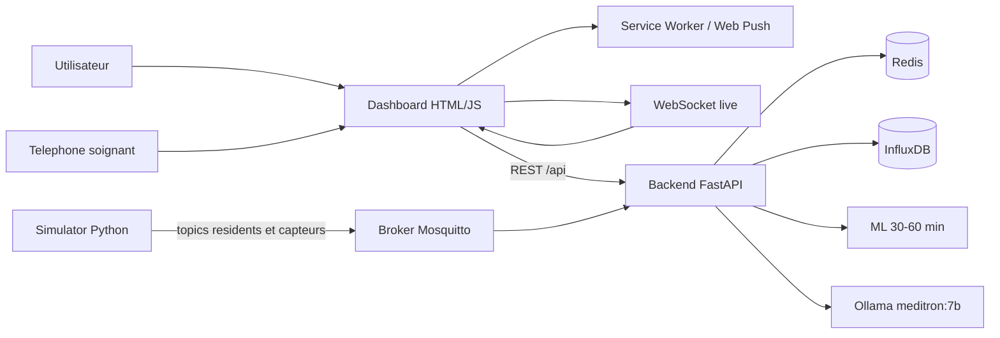

# EHPAD Monitor - Detection et prediction de malaise

Projet MBA1 Epitech de monitoring EHPAD connecte.

Le projet simule 25 residents, publie leurs constantes et capteurs ambiants via MQTT, applique des regles d'alerte graduees, calcule un risque ML 30-60 minutes, produit une synthese de transmission, puis expose le tout dans un dashboard web temps reel, une mini app soignant et un portail famille.

Pipeline principal: simulation -> MQTT -> backend -> Redis / InfluxDB -> dashboard -> soignant / famille / notifications.

Le systeme vise une assistance prudente et explicable. Il ne remplace pas un diagnostic medical autonome.

## Demarrage rapide

Commande recommandee pour Windows, macOS et Linux:

```bash
docker compose up --build -d
```

Commande a lancer depuis le dossier racine du projet:

```bash
cd <dossier-du-projet>
docker compose up --build -d
docker compose ps
```

Cette commande:

- construit et demarre toute la stack;
- lance le broker MQTT, Redis, InfluxDB, le simulateur, le backend, le worker LLM et le dashboard;
- marche directement dans PowerShell sur Windows;
- ne demande pas de build frontend React/Vite: le dashboard actuel est en HTML/JS statique.

LLM optionnel:

```bash
ollama serve
```

Le projet fonctionne sans Ollama: les rapports LLM ont un repli automatique.

## URLs utiles

- Dashboard principal: `http://localhost:3002`
- Espace soignant: `http://localhost:3002/soignant`
- Mini DPI resident: `http://localhost:3002/resident/R005?from=dashboard&return=/`
- Mini app intervention: `http://localhost:3002/mobile/resident/R005`
- Espace famille: `http://localhost:3002/famille.html`
- Admin familles: `http://localhost:3002/admin_famille.html`
- Backend API: `http://localhost:8001`
- Swagger: `http://localhost:8001/docs`
- InfluxDB: `http://localhost:8086`
- MQTT: `localhost:1883`

## Acces de demonstration

| Espace | Identifiant | Mot de passe / token |
|---|---|---|
| Soignant A | `soignant_A` | `EHPAD2024!` |
| Soignant B | `soignant_B` | `EHPAD2024!` |
| Soignant C | `soignant_C` | `EHPAD2024!` |
| Chef de garde | `chef_garde` | `EHPAD2024!` |
| Direction | `direction` | `EHPAD2024!` |
| Famille Edith Piaf | `piaf` | `piaf105` |
| Famille Marie Curie | `curie` | `curie101` |
| Famille Dalida | `dalida` | `dalida214` |
| Admin familles | token admin | `ADMIN_EHPAD_2024` |

La liste complete des comptes famille est dans `docs/comptes_famille_demo.md`.

## Mini app soignant sur telephone

La mini app soignant sert a recevoir les alertes, ouvrir une fiche intervention mobile et prendre en charge un resident depuis un telephone.

### Mode simple, sans notifications push

Ce mode suffit pour montrer l'app mobile au jury.

1. Demarrer la stack:

```bash
docker compose up --build -d
```

2. Trouver l'adresse IP du PC sur le reseau Wi-Fi:

```powershell
ipconfig
```

Prendre l'adresse IPv4 de la carte Wi-Fi, par exemple `192.168.1.85`.

3. Connecter le telephone au meme Wi-Fi que le PC.

4. Ouvrir dans le navigateur du telephone:

```text
http://192.168.1.85:3002/soignant
```

5. Se connecter avec:

```text
chef_garde / EHPAD2024!
```

6. Ouvrir une fiche resident depuis une notification ou directement:

```text
http://192.168.1.85:3002/mobile/resident/R005
```

### Mode PWA installee sur l'ecran d'accueil

La page soignant contient un manifest PWA (`dashboard/public/manifest.webmanifest`) et un service worker (`dashboard/public/sw.js`).

Sur Android Chrome:

1. Ouvrir `http://IP_DU_PC:3002/soignant`.
2. Se connecter.
3. Menu Chrome -> `Ajouter a l'ecran d'accueil`.
4. L'application apparait comme `EPicare`.

Sur iPhone Safari:

1. Ouvrir `http://IP_DU_PC:3002/soignant`.
2. Se connecter.
3. Bouton partager -> `Sur l'ecran d'accueil`.

### Mode push complet

Les notifications push navigateur exigent un contexte securise. Pour un telephone, il faut donc utiliser HTTPS:

```text
https://IP_DU_PC:3443/soignant
```

Le serveur dashboard demarre HTTPS sur le port `3443` si des certificats locaux sont presents dans `dashboard/certs/`.

Demarche:

1. Generer ou recuperer les certificats locaux compatibles avec l'IP du PC.
2. Les placer dans `dashboard/certs/`.
3. Installer l'autorite locale sur le telephone si necessaire.
4. Ouvrir `https://IP_DU_PC:3443/soignant`.
5. Se connecter avec un compte soignant.
6. Cliquer sur `Activer les alertes push`.
7. Cliquer sur `Envoyer un test push` pour verifier.

Important:

- `http://IP_DU_PC:3002` suffit pour la demo de l'interface mobile.
- `https://IP_DU_PC:3443` est necessaire pour tester les push reels.
- Les certificats locaux et cles privees ne doivent pas etre commites dans Git.

## Objectif

- simuler un EHPAD avec plusieurs residents et capteurs;
- visualiser les constantes, routines, positions et alertes en temps reel;
- prioriser les interventions soignantes;
- separer les vues soignant, direction et famille;
- fournir une demo simple a lancer avec Docker.

## Approche hybride

La logique reste volontairement hybride:

- regles cliniques et NEWS2 pour les alertes immediates;
- routines et capteurs ambiants pour le contexte de vie;
- ML pour le risque predictif 30-60 minutes;
- pipeline A2A pour combiner realtime, ML, comportement, alertes et transmission;
- LLM optionnel pour la synthese clinique, avec fallback local.

## Stack

- Simulator Python + `paho-mqtt`
- Mosquitto pour MQTT
- FastAPI pour REST + WebSocket
- Redis pour etat courant, sessions, cache et audits
- InfluxDB pour l'historique des constantes
- HTML / CSS / JavaScript statique pour le dashboard
- Express pour servir le dashboard et proxyfier `/api`
- `GradientBoostingClassifier` pour le score ML
- Ollama local avec `meditron:7b` pour le bonus LLM

## Schema structurel du projet

```mermaid
flowchart TB
    ROOT[projet spe Hepad/]

    ROOT --> COMPOSE[docker-compose.yml]
    ROOT --> DOCS[docs/]
    ROOT --> BACK[backend/]
    ROOT --> DASH[dashboard/]
    ROOT --> SIM[simulator/]
    ROOT --> MQTT[mosquitto/config/]
    ROOT --> TESTS[tests/]

    BACK --> B1[main.py]
    BACK --> B2[alert_engine.py]
    BACK --> B3[ml_model.py]
    BACK --> B4[a2a_agents.py]
    BACK --> B5[llm_service.py]
    BACK --> B6[routine_engine.py]
    BACK --> B7[auth.py]

    DASH --> D1[public/index.html]
    DASH --> D2[public/resident.html]
    DASH --> D3[public/mobile_resident.html]
    DASH --> D4[public/soignant.html]
    DASH --> D5[public/famille.html]
    DASH --> D6[server.js]

    SIM --> S1[main.py]
    SIM --> S2[profiles.py]
    SIM --> S3[facility_map.py]
```



Lecture rapide:

- `docker compose up --build -d` est la commande principale cross-platform;
- `backend/` porte la logique centrale: ingestion, alertes, ML, LLM, securite et API;
- `dashboard/public/` porte l'interface HTML statique;
- `simulator/` genere les constantes vitales et les capteurs ambiants;
- `docs/` contient les audits et guides de demonstration;
- `tests/` contient les tests pytest.

## Schema d'architecture



## Fonctionnement clinique

L'interface distingue plusieurs blocs:

- `Dashboard global`: 25 residents, constantes, alertes et priorisation.
- `Mini DPI`: profil, pathologies, capteurs, risque, historique et transmission.
- `Plan / capteurs`: localisation 2D/3D, chambres, zones, capteurs actifs.
- `Personnel`: soignants, affectations, charge, notifications et audit.
- `Famille`: carnet de vie sans constantes medicales.
- `ML/A2A`: prediction 30/60 minutes et synthese explicable.
- `Scalabilite`: MQTT, Redis, InfluxDB, WebSocket et objectifs de charge.

Important:

- le simulateur genere des donnees synthetiques;
- le ML montre une faisabilite technique, pas une validation medicale reelle;
- les alertes ne remplacent pas la decision soignante;
- le LLM est optionnel et retombe sur un fallback si indisponible.

## Organisation des fonctions

Le backend se repartit en couches distinctes.

- `Ingestion temps reel`
  - recoit les messages MQTT;
  - met a jour Redis, InfluxDB et le WebSocket;
  - fichiers: `backend/main.py`, `simulator/main.py`.

- `Regles et alertes`
  - calcule les niveaux 1 a 5;
  - integre NEWS2, capteurs, mouvement, routines et escalade;
  - fichiers: `backend/alert_engine.py`, `backend/main.py`.

- `ML predictif`
  - construit les features a partir des constantes et tendances;
  - produit `risk_30min` et `risk_60min`;
  - fichier: `backend/ml_model.py`.

- `Pipeline A2A`
  - combine realtime, ML, comportement, alertes, LLM et transmission;
  - fichier: `backend/a2a_agents.py`.

- `Mini DPI et transmissions`
  - agrege profil, constantes, capteurs, historique 30 jours et actions;
  - endpoints: `/api/reports/daily/{date}/{resident_id}` et `/api/residents/{id}/dpi`.

- `Soignants et notifications`
  - gere sessions, affectations, prise en charge et audit;
  - fichiers: `backend/auth.py`, `dashboard/public/soignant.html`.

- `Famille`
  - expose une vue non medicale du proche;
  - masque constantes, scores et alertes brutes;
  - fichiers: `dashboard/public/famille.html`, `backend/auth.py`.

## Separation regles / ML / LLM

- `Regles`
  - seuils immediats;
  - alertes critiques;
  - escalade et anti-bruit.

- `ML`
  - score predictif 30-60 minutes;
  - donnees synthetiques;
  - aide a prioriser, ne diagnostique pas.

- `LLM`
  - explique, synthetise et reformule;
  - utilise la KB locale;
  - n'est pas fine-tune par le projet;
  - fallback local si Ollama est indisponible.

## Services Docker

- `simulator`: simulation des residents, routines et capteurs;
- `mosquitto`: broker MQTT;
- `backend`: API, WebSocket, alertes, ML, LLM, securite;
- `dashboard`: dashboard HTML statique + proxy `/api`;
- `redis`: etat courant, sessions, caches et audits;
- `influxdb`: historique des constantes;
- `llm_worker`: generation de rapports LLM quotidiens optionnels.

## Endpoints principaux

- `GET /health`
- `GET /api/residents`
- `GET /api/alerts`
- `GET /api/alerts/config`
- `POST /api/alerts/{resident_id}/acknowledge`
- `GET /api/reports/daily/{date}/{resident_id}`
- `GET /api/a2a/predictions`
- `GET /api/a2a/predict/{resident_id}`
- `GET /api/ml/metrics`
- `GET /api/staff`
- `POST /api/staff/login`
- `GET /api/famille/{resident_id}`
- `POST /api/famille/login`
- `GET /api/ops/scalability`
- `WS /ws`

## Commandes utiles

Commande principale:

```bash
docker compose up --build -d
```

Support et verification:

```bash
docker compose ps
docker compose logs --tail=50 backend
docker compose logs --tail=50 simulator
docker compose down
```

Tests:

```bash
py -m pytest tests -q
py -m py_compile .\backend\main.py
py -m py_compile .\simulator\main.py
```

Verification API:

```powershell
Invoke-RestMethod http://localhost:8001/health
Invoke-RestMethod http://localhost:8001/api/residents
Invoke-RestMethod http://localhost:8001/api/alerts/config
Invoke-RestMethod http://localhost:8001/api/ml/metrics
Invoke-RestMethod http://localhost:8001/api/ops/scalability
```

## Demo conseillee

1. Demarrer Docker avec `docker compose up --build -d`.
2. Ouvrir le dashboard principal.
3. Montrer les 25 residents et les constantes live.
4. Montrer les alertes actives et la configuration des 5 niveaux.
5. Ouvrir un resident et son Mini DPI.
6. Montrer le plan 2D / 3D et les capteurs.
7. Ouvrir l'espace soignant avec `chef_garde / EHPAD2024!`.
8. Montrer la mini app telephone ou la fiche mobile.
9. Ouvrir l'espace famille avec `piaf / piaf105`.
10. Montrer ML/A2A et scalabilite.

Guide detaille: `docs/demo.md`.

## Limites actuelles

- Les donnees sont synthetiques.
- Le ML doit etre valide sur donnees reelles avant usage clinique.
- Le LLM local n'est pas obligatoire et peut etre lent selon la machine.
- Les notifications push dependent du navigateur, du HTTPS et du support mobile.
- Le mode demo reste prioritaire sur une exhaustivite clinique complete.

## Organisation des fichiers

```text
projet spe Hepad/
|-- backend/
|   |-- main.py
|   |-- alert_engine.py
|   |-- ml_model.py
|   |-- a2a_agents.py
|   |-- auth.py
|   |-- llm_service.py
|   |-- routine_engine.py
|   |-- kb/
|   `-- requirements.txt
|-- simulator/
|   |-- main.py
|   |-- profiles.py
|   |-- facility_map.py
|   `-- requirements.txt
|-- dashboard/
|   |-- public/
|   |   |-- index.html
|   |   |-- resident.html
|   |   |-- mobile_resident.html
|   |   |-- soignant.html
|   |   |-- famille.html
|   |   |-- admin_famille.html
|   |   |-- manifest.webmanifest
|   |   `-- sw.js
|   |-- server.js
|   |-- package.json
|   `-- Dockerfile
|-- mosquitto/config/mosquitto.conf
|-- docs/
|-- tests/test_ehpad.py
`-- docker-compose.yml
```

## Role des dossiers principaux

- `backend`: logique centrale du projet.
- `simulator`: generation des constantes et capteurs.
- `dashboard`: interface HTML, mini app soignant et portail famille.
- `docs`: architecture, audits, comptes demo et guide oral.
- `tests`: tests automatises.
- `data`: donnees generees localement.

## Securite

- Sessions soignant et famille stockees dans Redis.
- Acces DPI protege pour les pages soignant.
- Acces dashboard au Mini DPI sans prompt, via rapport resident non modifiant.
- Vue famille limitee: pas de constantes vitales ni scores cliniques.
- Logs d'acces, notifications, bris de glace et actions d'alerte.
- Certificats locaux exclus du Git via `.gitignore`.

## Arret

```bash
docker compose down
```
