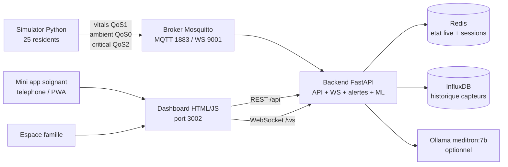
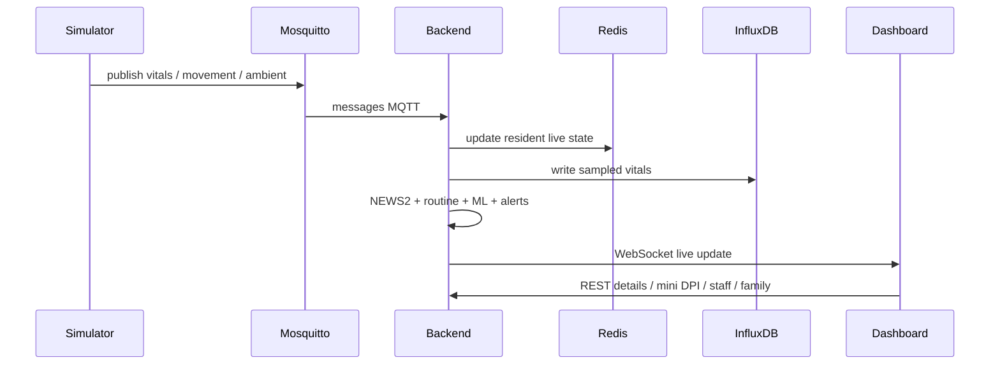
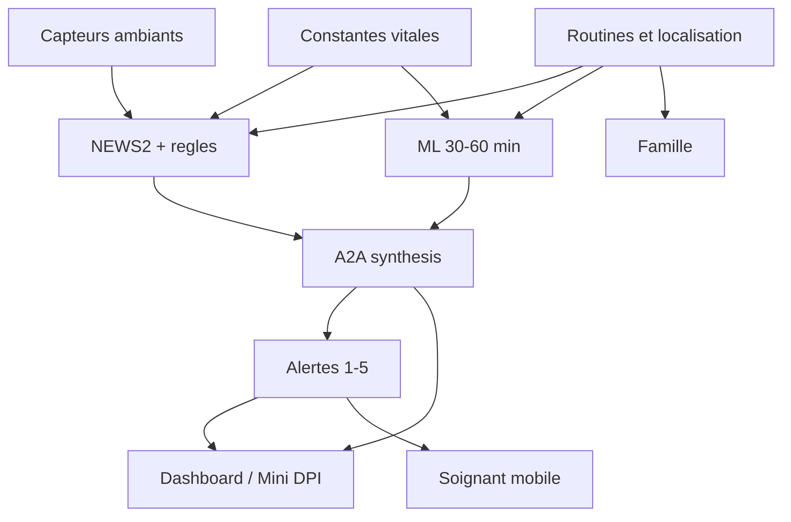

# EHPAD Monitor - Detection et prediction de malaise

Projet MBA1 Epitech de monitoring EHPAD connecte.

Le projet simule un etablissement EHPAD avec 25 residents, des constantes vitales,
des capteurs ambiants, un flux MQTT temps reel, un moteur d'alertes 5 niveaux,
une prediction ML 30-60 minutes, une interface soignant, une mini app mobile,
un portail famille et une couche de scalabilite observable.

Pipeline principal:

```text
simulation -> MQTT -> backend -> Redis / InfluxDB -> dashboard -> soignant / famille / notifications
```

Le systeme vise une assistance clinique prudente et explicable. Il ne remplace
pas un diagnostic medical autonome.

## Sommaire

- [Demarrage rapide](#demarrage-rapide)
- [Acces de demonstration](#acces-de-demonstration)
- [Mini app soignant sur telephone](#mini-app-soignant-sur-telephone)
- [Objectif du projet](#objectif-du-projet)
- [Approche hybride](#approche-hybride)
- [Stack technique](#stack-technique)
- [Architecture globale](#architecture-globale)
- [Flux temps reel](#flux-temps-reel)
- [Fonctionnement clinique](#fonctionnement-clinique)
- [Organisation des fonctions](#organisation-des-fonctions)
- [Alertes 5 niveaux](#alertes-5-niveaux)
- [ML et prediction](#ml-et-prediction)
- [Espace famille](#espace-famille)
- [Scalabilite](#scalabilite)
- [Endpoints principaux](#endpoints-principaux)
- [Commandes utiles](#commandes-utiles)
- [Demo conseillee](#demo-conseillee)
- [Tests et verification](#tests-et-verification)
- [Organisation des fichiers](#organisation-des-fichiers)
- [Securite](#securite)
- [Limites actuelles](#limites-actuelles)

## Demarrage rapide

Commande recommandee pour Windows, macOS et Linux:

```bash
docker compose up --build -d
```

Commande a lancer depuis le dossier racine du projet:

```bash
cd <dossier-du-projet>
docker compose up --build -d
docker compose ps
```

Cette commande:

- construit et demarre toute la stack;
- lance MQTT, Redis, InfluxDB, simulateur, backend, worker LLM et dashboard;
- fonctionne directement dans PowerShell sur Windows;
- ne demande pas de build React/Vite: le dashboard actuel est en HTML/JS statique.

LLM optionnel:

```bash
ollama serve
```

Le projet fonctionne sans Ollama: les rapports LLM ont un fallback local.

## Prerequis

- Docker Desktop ou Docker Engine avec `docker compose`.
- Ports disponibles: `3002`, `3443`, `8001`, `1883`, `9001`, `6379`, `8086`.
- Pour le LLM bonus: Ollama installe et modele `meditron:7b`.
- Pour tester la mini app sur telephone: PC et telephone sur le meme reseau Wi-Fi.
- Pour tester les push mobiles reels: HTTPS local avec certificats dans `dashboard/certs/`.

## Scripts de secours

La commande principale reste:

```bash
docker compose up --build -d
```

Des scripts sont disponibles si vous voulez un demarrage assiste avec attente du
backend et du dashboard.

Windows PowerShell:

```powershell
.\start-demo.ps1
```

Windows double-clic:

```bat
start-demo.cmd
```

macOS / Linux / Git Bash:

```bash
NO_BROWSER=1 ./start.sh
```

Ces scripts:

- verifient Docker;
- lancent la stack;
- attendent `http://localhost:8001/health`;
- attendent `http://localhost:3002`;
- affichent les URLs utiles.

## URLs utiles

- Dashboard principal: `http://localhost:3002`
- Espace soignant: `http://localhost:3002/soignant`
- Mini DPI resident: `http://localhost:3002/resident/R005?from=dashboard&return=/`
- Mini app intervention: `http://localhost:3002/mobile/resident/R005`
- Espace famille: `http://localhost:3002/famille.html`
- Admin familles: `http://localhost:3002/admin_famille.html`
- Backend API: `http://localhost:8001`
- Swagger: `http://localhost:8001/docs`
- InfluxDB: `http://localhost:8086`
- MQTT: `localhost:1883`
- MQTT WebSocket: `localhost:9001`

## Acces de demonstration

| Espace | Identifiant | Mot de passe / token | Role |
|---|---|---|---|
| Soignant A | `soignant_A` | `EHPAD2024!` | secteur affecte |
| Soignant B | `soignant_B` | `EHPAD2024!` | secteur affecte |
| Soignant C | `soignant_C` | `EHPAD2024!` | secteur affecte |
| Chef de garde | `chef_garde` | `EHPAD2024!` | acces privilegie |
| Direction | `direction` | `EHPAD2024!` | supervision |
| Famille Edith Piaf | `piaf` | `piaf105` | proche R005 |
| Famille Marie Curie | `curie` | `curie101` | proche R001 |
| Famille Dalida | `dalida` | `dalida214` | proche R019 |
| Admin familles | token admin | `ADMIN_EHPAD_2024` | gestion comptes famille |

La liste complete des comptes famille est dans `docs/comptes_famille_demo.md`.

## Activation des fonctions

Les variables principales sont documentees dans `.env.example`.

| Variable | Valeur demo | Role |
|---|---|---|
| `NUM_RESIDENTS` | `25` | nombre de residents simules |
| `STAFF_DEMO_PASSWORD` | `EHPAD2024!` | mot de passe demo personnel |
| `FAMILLE_ADMIN_TOKEN` | `ADMIN_EHPAD_2024` | token admin familles |
| `REDIS_PASSWORD` | `change-me-redis-long-random` | protection Redis |
| `INFLUX_TOKEN` | `change-me-influx-token` | token InfluxDB |
| `OLLAMA_HOST` | `http://host.docker.internal:11434` | URL Ollama depuis Docker |
| `OLLAMA_MODEL` | `meditron:7b` | modele LLM local |
| `LLM_DAILY_AUTO_ENABLED` | `false` backend, `true` worker | generation auto rapports LLM |
| `HTTPS_REQUIRED` | `false` | force HTTPS hors localhost si active |
| `ALLOWED_ORIGINS` | localhost dashboard | CORS API |
| `VAPID_PUBLIC_KEY` / `VAPID_PRIVATE_KEY` | vide ou demo compose | Web Push navigateur |

Utilisation conseillee:

```bash
cp .env.example .env
docker compose up --build -d
```

Pour une soutenance locale, les valeurs par defaut de `docker-compose.yml`
suffisent. Pour un rendu propre, remplacez les secrets demo si le projet est
publie.

## Mini app soignant sur telephone

La mini app soignant sert a recevoir les alertes, ouvrir une fiche intervention
mobile et prendre en charge un resident depuis un telephone.

### Mode simple, sans notifications push

Ce mode suffit pour montrer l'interface mobile au jury.

1. Demarrer la stack:

```bash
docker compose up --build -d
```

2. Trouver l'adresse IP du PC sur le reseau Wi-Fi:

```powershell
ipconfig
```

Prendre l'adresse IPv4 de la carte Wi-Fi, par exemple `192.168.1.85`.

3. Connecter le telephone au meme Wi-Fi que le PC.

4. Ouvrir dans le navigateur du telephone:

```text
http://192.168.1.85:3002/soignant
```

5. Se connecter avec:

```text
chef_garde / EHPAD2024!
```

6. Ouvrir une fiche mobile:

```text
http://192.168.1.85:3002/mobile/resident/R005
```

### Mode PWA installee sur l'ecran d'accueil

La page soignant contient:

- un manifest PWA: `dashboard/public/manifest.webmanifest`;
- un service worker: `dashboard/public/sw.js`;
- une page mobile: `dashboard/public/mobile_resident.html`.

Sur Android Chrome:

1. Ouvrir `http://IP_DU_PC:3002/soignant`.
2. Se connecter.
3. Menu Chrome -> `Ajouter a l'ecran d'accueil`.
4. L'application apparait comme `EPicare`.

Sur iPhone Safari:

1. Ouvrir `http://IP_DU_PC:3002/soignant`.
2. Se connecter.
3. Bouton partager -> `Sur l'ecran d'accueil`.

### Mode push complet

Les notifications push navigateur exigent un contexte securise. Pour un
telephone, il faut donc utiliser HTTPS:

```text
https://IP_DU_PC:3443/soignant
```

Le serveur dashboard demarre HTTPS sur le port `3443` si des certificats
locaux sont presents dans `dashboard/certs/`.

Demarche:

1. Generer ou recuperer des certificats locaux compatibles avec l'IP du PC.
2. Les placer dans `dashboard/certs/`.
3. Installer l'autorite locale sur le telephone si necessaire.
4. Ouvrir `https://IP_DU_PC:3443/soignant`.
5. Se connecter avec un compte soignant.
6. Cliquer sur `Activer les alertes push`.
7. Cliquer sur `Envoyer un test push`.

Important:

- `http://IP_DU_PC:3002` suffit pour la demo mobile.
- `https://IP_DU_PC:3443` est necessaire pour les push reels.
- Les certificats locaux et cles privees ne doivent pas etre commites dans Git.

## Objectif du projet

- simuler un EHPAD multi-residents;
- publier les donnees capteurs en MQTT;
- detecter les risques immediats et les alertes critiques;
- predire un risque d'aggravation a 30-60 minutes;
- prioriser les interventions soignantes;
- fournir une vue famille non medicale;
- demontrer la scalabilite et la robustesse Docker.

## Approche hybride

La logique reste volontairement hybride:

- `Regles cliniques`: seuils vitaux, chute, SOS, NEWS2, anti-bruit.
- `Contexte comportemental`: routine, zone, repas, sommeil, inactivite.
- `Capteurs ambiants`: porte, lit, sol, radar, PIR, salle de bain.
- `ML`: score predictif 30-60 minutes.
- `A2A`: orchestration realtime + ML + comportement + alertes + transmission.
- `LLM`: synthese optionnelle via Ollama, avec fallback local.

## Stack technique

- Python 3.11 pour backend et simulateur.
- FastAPI pour API REST et WebSocket.
- Paho MQTT pour publication / consommation capteurs.
- Mosquitto pour le broker MQTT.
- Redis pour etat courant, sessions, cache, audit et predictions.
- InfluxDB pour historique de constantes.
- Scikit-learn pour le modele `GradientBoostingClassifier`.
- HTML / CSS / JavaScript statique pour le dashboard.
- Three.js pour la vue 3D de l'EHPAD.
- Express pour servir le dashboard et proxyfier `/api`.
- Ollama + `meditron:7b` pour les rapports LLM optionnels.
- Docker Compose pour lancer l'ensemble.

## Architecture globale



Lecture rapide:

- le simulateur publie les etats residents et capteurs;
- le backend consomme MQTT, calcule alertes/ML et stocke l'etat;
- Redis garde le live et les sessions;
- InfluxDB garde l'historique;
- le dashboard interroge l'API et recoit le live en WebSocket;
- la mini app telephone utilise la page soignant + service worker;
- l'espace famille utilise un token limite a un resident.

## Lecture de l'architecture

- Le simulateur genere les constantes et evenements de vie a partir de profils
  residents, routines, chambres et scenarios.
- Il publie les donnees sur MQTT avec differents niveaux de QoS selon la criticite.
- Le backend consomme les messages MQTT, enrichit l'etat resident, calcule le
  score NEWS2, detecte les alertes, ecrit l'historique et diffuse le live.
- Redis conserve l'etat courant, les sessions, les audits et les caches.
- InfluxDB conserve les series temporelles de constantes.
- Le dashboard affiche le temps reel, les alertes, le plan, le Mini DPI, les
  transmissions, le personnel et la scalabilite.
- La mini app soignant reutilise le meme backend mais avec une interface mobile
  orientee intervention.
- L'espace famille expose uniquement une vue non medicale du proche.
- Le ML et l'A2A apportent une aide prospective, sans prendre de decision
  medicale autonome.

## Schema structurel du projet

```mermaid
flowchart TB
    ROOT[projet spe Hepad/]

    ROOT --> COMPOSE[docker-compose.yml]
    ROOT --> DOCS[docs/]
    ROOT --> BACK[backend/]
    ROOT --> DASH[dashboard/]
    ROOT --> SIM[simulator/]
    ROOT --> MQTTCONF[mosquitto/config/]
    ROOT --> TESTS[tests/]
    ROOT --> DATA[data/]

    BACK --> B1[main.py]
    BACK --> B2[alert_engine.py]
    BACK --> B3[ml_model.py]
    BACK --> B4[a2a_agents.py]
    BACK --> B5[llm_service.py]
    BACK --> B6[routine_engine.py]
    BACK --> B7[auth.py]
    BACK --> B8[kb/ehpad_watch_kb.json]

    DASH --> D1[public/index.html]
    DASH --> D2[public/resident.html]
    DASH --> D3[public/mobile_resident.html]
    DASH --> D4[public/soignant.html]
    DASH --> D5[public/famille.html]
    DASH --> D6[public/admin_famille.html]
    DASH --> D7[server.js]

    SIM --> S1[main.py]
    SIM --> S2[profiles.py]
    SIM --> S3[facility_map.py]
```



## Flux temps reel



## Schema fonctionnel



Lecture fonctionnelle:

- les constantes alimentent a la fois les regles et le ML;
- les capteurs ambiants confirment ou contextualisent les evenements;
- les routines evitent de confondre un comportement normal et un signal faible;
- l'A2A transforme les scores en priorite et transmission lisible;
- le dashboard et l'app soignant affichent les donnees medicales;
- la famille ne voit qu'un carnet de vie filtre.

## Fonctionnement clinique

L'interface distingue plusieurs blocs:

- `Dashboard global`: 25 residents, constantes, alertes et priorisation.
- `Mini DPI`: profil, pathologies, capteurs, risque, historique et transmission.
- `Plan / capteurs`: localisation 2D/3D, chambres, zones, capteurs actifs.
- `Personnel`: soignants, affectations, charge, notifications et audit.
- `Famille`: carnet de vie sans constantes medicales.
- `ML/A2A`: prediction 30/60 minutes et synthese explicable.
- `Scalabilite`: MQTT, Redis, InfluxDB, WebSocket et objectifs de charge.

Important:

- le simulateur ne change pas selon une validation medicale humaine;
- le LLM n'est pas reentraine localement;
- les rapports LLM sont une aide de synthese, pas un avis medical officiel;
- l'entrainement ML reste separe du moteur d'alerte live;
- le Mini DPI dashboard utilise un rapport frais pour eviter un cache ancien.

## Organisation des fonctions

Le backend est organise par responsabilites.

### Ingestion temps reel

- recoit les messages MQTT;
- met a jour l'etat resident;
- stocke les constantes;
- diffuse au WebSocket.

Fichiers principaux:

- `backend/main.py`
- `simulator/main.py`
- `backend/ws_manager.py`

### Regles et alertes

- calcule les niveaux 1 a 5;
- integre constantes, mouvement, capteurs, routines et NEWS2;
- gere escalade, acquittement, prise en charge et resolution.

Fichiers principaux:

- `backend/alert_engine.py`
- `backend/main.py`

### Prediction ML

- construit les features vitales et tendances;
- calcule `risk_30min` et `risk_60min`;
- expose les metriques du modele.

Fichier principal:

- `backend/ml_model.py`

### Pipeline A2A

- combine realtime, ML, comportement, alertes et transmission;
- produit des actions soignantes et points de vigilance.

Fichier principal:

- `backend/a2a_agents.py`

### Mini DPI et transmissions

- agrege profil, constantes, capteurs, historique 30 jours, risque et actions;
- fournit une vue resident exploitable par le dashboard.

Endpoints:

- `/api/reports/daily/{date}/{resident_id}`
- `/api/residents/{resident_id}/dpi`

### Soignants et notifications

- gere sessions personnel;
- controle les acces DPI;
- suit les affectations;
- trace vues, prises en charge, acquittements et push.

Fichiers principaux:

- `backend/auth.py`
- `dashboard/public/soignant.html`
- `dashboard/public/mobile_resident.html`

### Famille

- compte individuel par famille;
- token limite a un resident;
- vue volontairement non medicale.

Fichiers principaux:

- `backend/auth.py`
- `dashboard/public/famille.html`
- `dashboard/public/admin_famille.html`

### Plan et capteurs

- affiche les chambres et zones sur un plan 2D;
- affiche une vue 3D Three.js de l'etablissement;
- relie chaque resident a une position;
- affiche capteurs actifs, qualite, batterie et dernier signal.

Fichiers principaux:

- `dashboard/public/index.html`
- `dashboard/public/resident.html`
- `simulator/facility_map.py`

### Scalabilite et exploitation

- mesure le debit MQTT global et sur 60 secondes;
- expose les compteurs vitaux / ambiants;
- estime la pression InfluxDB et WebSocket;
- donne des recommandations pour tester 50 residents.

Endpoint:

- `/api/ops/scalability`

## Alertes 5 niveaux

| Niveau | Nom | Usage | Routage |
|---|---|---|---|
| 1 | Information | signal faible / suivi dashboard | dashboard |
| 2 | Attention | anomalie a surveiller | soignant assigne |
| 3 | Alerte | intervention recommandee | soignant + son |
| 4 | Urgence | intervention rapide | tous soignants |
| 5 | Danger vital | protocole critique | tous + direction + SAMU selon protocole |

Points importants:

- les niveaux 1-3 sont limites par une politique anti-bruit;
- les alertes de routine seules ne montent pas artificiellement en danger vital;
- le niveau 5 est reserve aux signaux critiques ou escalades graves;
- le dashboard possede un rendu visuel specifique pour chaque niveau.

## ML et prediction

Le modele ML est une preuve de concept basee sur donnees synthetiques.

Features principales:

- frequence cardiaque;
- SpO2;
- pression arterielle systolique;
- temperature;
- inactivite;
- tendance FC;
- tendance SpO2;
- facteur age;
- facteur risque resident.

Sorties:

- `risk_30min`;
- `risk_60min`;
- tendance;
- signaux faibles;
- metriques exposees dans `/api/ml/metrics`.

Message a retenir pour le jury:

```text
Le ML montre une chaine predictive technique 30-60 minutes. Il ne constitue pas
une validation medicale reelle. En production, il faudrait des donnees EHPAD
reelles, un split temporel et une validation clinique.
```

## Separation regles / ML / LLM

### Regles

- seuils immediats;
- NEWS2;
- chute, SOS, fugue;
- escalade;
- fallback d'analyse si le LLM ne repond pas.

### ML

- apprend un risque a partir de donnees synthetiques;
- produit `risk_30min` et `risk_60min`;
- s'appuie sur `StandardScaler + GradientBoostingClassifier`;
- ne choisit pas seul le niveau final;
- ne remplace pas la decision soignante.

### LLM

- reformule une synthese clinique;
- utilise contexte resident, historique, alertes et KB locale;
- n'est pas fine-tune par le projet;
- retombe sur un fallback local si Ollama est indisponible ou trop lent.

## Espace famille

L'espace famille est volontairement limite.

Visible:

- nom du resident;
- avatar;
- chambre;
- etat general;
- activite;
- soignant referent;
- menu;
- programme de vie;
- dernieres activites.

Masque:

- frequence cardiaque;
- SpO2;
- pression arterielle;
- temperature;
- scores cliniques;
- alertes brutes;
- predictions ML detaillees.

## Scalabilite

Endpoint:

```text
GET /api/ops/scalability
```

Il expose:

- nombre de residents;
- debit MQTT total;
- debit MQTT sur 60 secondes;
- messages vitaux / ambiants;
- age du dernier message;
- estimation InfluxDB;
- debit WebSocket;
- frequence du pipeline de prediction;
- recommandations de montee en charge.

Objectif de demo:

- montrer que 25 residents tournent en continu;
- montrer que la cible 20 residents est depassee;
- expliquer que Redis garde le live et InfluxDB garde l'historique.

## Notifications

Le projet supporte:

- notifications live dans l'application soignant;
- notifications navigateur via Service Worker;
- Web Push serveur si les cles VAPID sont configurees;
- audit des livraisons push.

Routes associees:

- `GET /api/push/config`
- `GET /api/push/status`
- `POST /api/push/subscribe`
- `DELETE /api/push/subscribe`
- `POST /api/push/test`
- `POST /api/push/test-all`
- `GET /api/push/delivery/{alert_id}`
- `GET /api/push/audit`

Limites importantes:

- les push reels demandent HTTPS sur telephone;
- un onglet ferme peut recevoir les notifications selon navigateur;
- un navigateur totalement ferme depend du systeme mobile et du navigateur;
- pour la demo jury, la fiche mobile fonctionne sans push.

## LLM local

Le projet utilise par defaut `meditron:7b` via Ollama.

Activation simple:

```powershell
ollama serve
docker compose up --build -d backend llm_worker
```

Variables utiles:

- `OLLAMA_HOST`
- `OLLAMA_MODEL`
- `LLM_DAILY_AUTO_ENABLED`
- `LLM_DAILY_TTL_DAYS`

Le backend retombe sur un fallback local si le LLM est indisponible ou trop lent.

## Services Docker

| Service | Role | Port |
|---|---|---|
| `mosquitto` | broker MQTT | `1883`, `9001` |
| `redis` | etat courant, sessions, cache | `6379` |
| `influxdb` | historique capteurs | `8086` |
| `simulator` | generation residents/capteurs | interne |
| `backend` | API, WS, ML, alertes | `8001` |
| `llm_worker` | rapports LLM quotidiens | interne |
| `dashboard` | dashboard HTML + proxy API | `3002`, `3443` |

## Endpoints principaux

| Endpoint | Description |
|---|---|
| `GET /health` | sante backend |
| `GET /api/residents` | 25 residents live |
| `GET /api/residents/{id}` | detail resident protege |
| `GET /api/residents/{id}/dpi` | mini DPI protege |
| `GET /api/reports/daily/{date}/{id}` | mini DPI frais pour dashboard |
| `GET /api/alerts` | alertes actives + historique |
| `GET /api/alerts/config` | configuration 5 niveaux |
| `POST /api/alerts/{id}/acknowledge` | acquittement |
| `GET /api/alerts/explain/{id}` | explication alerte |
| `GET /api/a2a/predictions` | predictions 25 residents |
| `GET /api/a2a/predict/{id}` | prediction protegee resident |
| `GET /api/ml/metrics` | metriques ML |
| `GET /api/staff` | personnel et affectations |
| `POST /api/staff/login` | login soignant |
| `GET /api/famille/{id}` | vue famille protegee |
| `POST /api/famille/login` | login famille |
| `GET /api/ops/scalability` | stats scalabilite |
| `GET /api/push/config` | configuration Web Push |
| `POST /api/push/subscribe` | inscription telephone |
| `POST /api/push/test` | test push soignant |
| `GET /api/llm/report/{id}` | rapport LLM resident |
| `GET /api/llm/daily/{date}` | statut rapports quotidiens |
| `GET /api/security/access-log` | journal acces DPI |
| `GET /api/security/break-glass` | journal bris de glace |
| `WS /ws` | flux live dashboard |

## Commandes utiles

Commande principale:

```bash
docker compose up --build -d
```

Support:

```bash
docker compose ps
docker compose logs --tail=50 backend
docker compose logs --tail=50 simulator
docker compose down
```

Scripts:

```powershell
.\start-demo.ps1
```

```bash
NO_BROWSER=1 ./start.sh
```

Tests:

```bash
py -m pytest tests -q
py -m py_compile .\backend\main.py
py -m py_compile .\simulator\main.py
```

Verification API:

```powershell
Invoke-RestMethod http://localhost:8001/health
Invoke-RestMethod http://localhost:8001/api/residents
Invoke-RestMethod http://localhost:8001/api/alerts/config
Invoke-RestMethod http://localhost:8001/api/ml/metrics
Invoke-RestMethod http://localhost:8001/api/ops/scalability
```

Validation Docker depuis zero:

```bash
docker compose down
docker compose up --build -d
docker compose ps
```

## Demo conseillee

1. Demarrer Docker avec `docker compose up --build -d`.
2. Ouvrir le dashboard principal.
3. Montrer les 25 residents et les constantes live.
4. Montrer les alertes actives et la configuration 5 niveaux.
5. Ouvrir un resident et son Mini DPI.
6. Montrer le plan 2D / 3D et les capteurs.
7. Ouvrir l'espace soignant avec `chef_garde / EHPAD2024!`.
8. Montrer la mini app telephone ou la fiche mobile.
9. Ouvrir l'espace famille avec `piaf / piaf105`.
10. Montrer ML/A2A et scalabilite.

Guide detaille:

- `docs/demo.md`

## Correspondance cahier des charges

| Demande ecole | Realisation projet | Statut |
|---|---|---|
| 20 residents minimum | 25 residents simules | OK |
| Capteurs vitaux | FC, SpO2, PA, temperature, FR | OK |
| Capteurs ambiants | porte, lit, PIR, radar, sol, SDB | OK |
| MQTT | Mosquitto + QoS 0/1/2 | OK |
| Dashboard multi-residents | grille 25 residents + detail | OK |
| Alertes 5 niveaux | information a danger vital | OK |
| Docker Compose | stack complete avec healthchecks | OK |
| Prediction 30-60 min | ML + A2A | Bonus |
| Historique / routines | Redis + InfluxDB + routine engine | Bonus |
| Personnel / escalade | app soignant, affectations, audits | Bonus |
| Famille | portail famille filtre | Bonus |
| Plan / capteurs | SVG 2D + Three.js + qualite capteurs | Bonus |
| Scalabilite | endpoint MQTT/Redis/WebSocket | Bonus |

## Tests et verification

Le projet contient des tests pytest dans `tests/test_ehpad.py`.

Verification minimale avant rendu:

```bash
docker compose up --build -d
docker compose ps
py -m pytest tests -q
```

Verification fonctionnelle:

- `GET /health` doit repondre `ok`;
- `/api/residents` doit retourner 25 residents;
- `/api/alerts/config` doit retourner 5 niveaux;
- `/api/ml/metrics` doit retourner les metriques;
- `/api/ops/scalability` doit retourner les stats MQTT.

## Organisation des fichiers

```text
projet spe Hepad/
|-- backend/
|   |-- main.py
|   |-- alert_engine.py
|   |-- ml_model.py
|   |-- a2a_agents.py
|   |-- auth.py
|   |-- llm_service.py
|   |-- routine_engine.py
|   |-- resident_profiles.py
|   |-- kb_loader.py
|   |-- kb/
|   `-- requirements.txt
|-- simulator/
|   |-- main.py
|   |-- profiles.py
|   |-- facility_map.py
|   `-- requirements.txt
|-- dashboard/
|   |-- public/
|   |   |-- index.html
|   |   |-- resident.html
|   |   |-- mobile_resident.html
|   |   |-- soignant.html
|   |   |-- famille.html
|   |   |-- admin_famille.html
|   |   |-- simulateur_config.html
|   |   |-- manifest.webmanifest
|   |   `-- sw.js
|   |-- server.js
|   |-- package.json
|   `-- Dockerfile
|-- mosquitto/
|   `-- config/mosquitto.conf
|-- docs/
|-- tests/
|-- data/
|-- docker-compose.yml
`-- README.md
```

## Role des dossiers principaux

- `backend`: logique centrale du projet.
- `simulator`: generation des constantes et capteurs.
- `dashboard`: interface HTML, mini app soignant, portail famille.
- `docs`: architecture, audits, comptes demo et guide oral.
- `tests`: tests automatises.
- `data`: donnees generees localement.
- `mosquitto`: configuration du broker MQTT.

## Fichiers importants

Backend:

- `backend/main.py`: routes API, MQTT, WebSocket, rapports.
- `backend/alert_engine.py`: moteur d'alertes 5 niveaux.
- `backend/ml_model.py`: entrainement et prediction ML.
- `backend/a2a_agents.py`: pipeline agentique.
- `backend/auth.py`: sessions famille et personnel.
- `backend/llm_service.py`: rapports LLM et fallback.

Dashboard:

- `dashboard/public/index.html`: dashboard principal.
- `dashboard/public/resident.html`: Mini DPI complet.
- `dashboard/public/mobile_resident.html`: fiche intervention mobile.
- `dashboard/public/soignant.html`: app soignant / PWA / push.
- `dashboard/public/famille.html`: portail famille.
- `dashboard/server.js`: serveur statique + proxy API.

Simulateur:

- `simulator/main.py`: generation et publication MQTT.
- `simulator/profiles.py`: residents, chambres, capteurs, profils.
- `simulator/facility_map.py`: plan, zones et trajets.

## Securite

- Sessions soignant et famille stockees dans Redis.
- Acces DPI protege pour les pages soignant.
- Acces dashboard au Mini DPI sans prompt, via rapport resident non modifiant.
- Vue famille limitee: pas de constantes vitales ni scores cliniques.
- Logs d'acces, notifications, bris de glace et actions d'alerte.
- Redis protege par mot de passe via variable d'environnement.
- Certificats locaux exclus du Git via `.gitignore`.
- Les cles privees locales ne doivent jamais etre commitees.

## Limites actuelles

- Les donnees sont synthetiques.
- Le ML doit etre valide sur donnees reelles avant usage clinique.
- Le split temporel serait obligatoire avec des donnees reelles.
- Le LLM local n'est pas obligatoire et peut etre lent selon la machine.
- Les notifications push dependent du navigateur, du HTTPS et du support mobile.
- Le mode demo reste prioritaire sur une exhaustivite clinique complete.

## References utiles du projet

- `docs/architecture.md`
- `docs/demo.md`
- `docs/securite_rgpd.md`
- `docs/comptes_famille_demo.md`
- `backend/kb/ehpad_watch_kb.json`
- `docker-compose.yml`

## Arret

```bash
docker compose down
```
