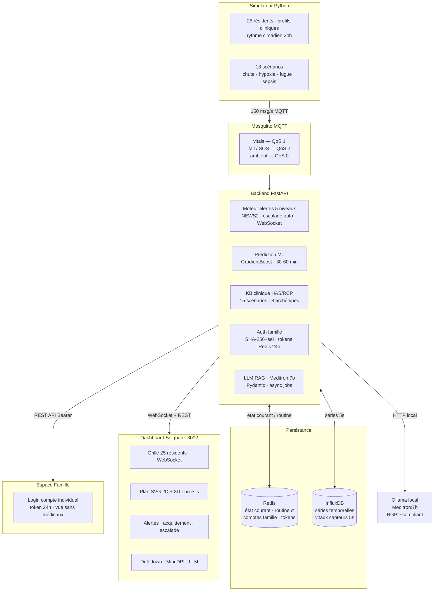

# Architecture technique — EPicare Palace

## Vue d'ensemble



---

## 1. Simulateur (`simulator/main.py`)

### Residents

25 residents sur 2 niveaux avec profils cliniques complets :
pathologies, mobilite, facteur de risque, soignant referent, code famille, archetype KB.

### Rythme circadien

Chaque constante suit un cycle physiologique 24h modelise par des gaussiennes :

- BP : +12 mmHg a 8h, +6 mmHg a 14h, -10 mmHg a 4h
- HR : -8 bpm a 4h, +5 bpm a midi, +4 bpm a 18h30
- Temp : -0.4 C a 4h, +0.4 C a 17h
- SpO2 : cycles d'apnee du sommeil si risque > 0.4

### Scenarios (18)

Declenchement par probabilite x ponderation temporelle :

| Periode | Poids chute |
|---|---|
| lever_toilette | 2.5x |
| coucher | 2.2x |
| trajet_dejeuner / diner | 2.0x |
| nuit | 1.8x |
| sieste | 0.3x |

Scenarios : hypoxie, chute, fugue, malaise_repas, hypotension, infection, deshydratation, AVC suspect...

### MQTT

| Topic | QoS | Contenu |
|---|---|---|
| `ehpad/resident/{id}/vitals` | 1 | FC, SpO2, PA, Temp, FR |
| `ehpad/resident/{id}/fall` | 2 | Impact g, position |
| `ehpad/resident/{id}/sos` | 2 | Declenchement manuel |
| `ehpad/zone/{zone}/ambient` | 0 | Temp, humidite, CO2, mouvement |

---

## 2. Backend (`backend/main.py`)

Framework : FastAPI + Pydantic + asyncio

### Moteur d'alertes (`alert_engine.py`)

5 niveaux avec escalade automatique :

| Niveau | Nom | Declencheurs principaux | Escalade |
|---|---|---|---|
| 1 | Information | Inactivite inhabituelle 30 min | — |
| 2 | Attention | SpO2 < 95%, FC > 100, NEWS2 >= 3 | → L3 en 10 min |
| 3 | Alerte | SpO2 < 93%, FC > 120, chute legere, NEWS2 >= 5 | → L4 en 5 min |
| 4 | Urgence | Chute + immobilite, SpO2 < 88%, NEWS2 >= 7 | → L5 en 3 min |
| 5 | Danger vital | SpO2 < 85% + FC > 130, PA critique, NEWS2 >= 9 | — |

**Mode nuit** : seuils SpO2 assouplis pendant le sommeil (SpO2 L2=92% vs 95% le jour).

### Score NEWS2

National Early Warning Score 2 (Royal College of Physicians, 2017).
6 parametres : FC, FR, SpO2, PA systolique, temperature, conscience/confusion.
Ajoute comme condition OR sur les niveaux d'alerte — ne remplace pas les regles directes.

### Modele ML (`ml_model.py`)

Algorithme : `GradientBoostingClassifier` (scikit-learn)

Justification du choix vs alternatives :

| Algorithme | Avantage | Inconvenient retenu |
|---|---|---|
| GradientBoosting | Robuste, interpretable, performant sur tabular | Plus lent a entrainer |
| Random Forest | Stable | Moins performant sur desequilibre de classes |
| SVM | Bon en haute dimension | Peu interpretable, lent sur gros volumes |
| Reseau de neurones | Tres puissant | Necessite beaucoup de donnees reelles |
| Logistic Regression | Simple | Insuffisant pour interactions non lineaires |

9 features : FC, SpO2, PA, Temp, inactivite, delta FC 10 min, delta SpO2 10 min, age_factor, risk_factor.

Metriques medicales exposees :
- **Sensibilite** (recall malaise) : minimise les malaises manques
- **Specificite** (recall normal) : minimise les fausses alarmes (fatigue soignants)
- AUC-ROC, F1, matrice de confusion, importance des features

### Analyse de routine (`_track_routine`)

Par resident et par periode de la journee, stocke les 100 dernieres valeurs de FC dans Redis.
Alerte si deviation > 2.5 sigma (et ecart-type > 2 bpm pour eviter les faux positifs).
Cle Redis : `routine:{resident_id}:{time_of_day}`, TTL 7 jours.

### Base de connaissances clinique (`kb_loader.py`)

Fichier : `backend/kb/ehpad_watch_kb.json`

| Section | Contenu |
|---|---|
| sources | 16 references (HAS, RCP, WHO, CDC, Ameli, VIDAL, NCBI, HL7/FHIR) |
| scenarios | 15 scenarios cliniques avec regles de declenchement et signaux precoces |
| archetypes | 8 profils residents avec baseline et scenarios preferes |
| medication_risk_library | 13 classes medicamenteuses avec facteurs de boost |
| family_interface_policy | Champs interdits pour l'espace famille |
| nursing_transmission | Format SBAR pour les transmissions IDE |

Chargement unique au demarrage (`@lru_cache`).
Chaque resident est enrichi automatiquement : `archetype_id`, `likely_medications`, `preferred_scenarios`.

### Authentification famille (`auth.py`)

- Comptes stockes dans Redis : `famille:account:{username}`
- Mot de passe hache : SHA-256 + sel aleatoire (16 octets)
- Token de session : `secrets.token_urlsafe(32)`, TTL 24h dans Redis
- Cle token : `famille:token:{token}`
- 25 comptes demo crees au demarrage (`seed_demo_accounts`)
- Admin protege par token env `FAMILLE_ADMIN_TOKEN`

En production : remplacer SHA-256 par bcrypt (cost=12), ajouter rate limiting (5 req/min sur /login), HTTPS obligatoire.

### Rapport LLM (`/api/llm/report/{id}`)

Modele : **Meditron:7b** via Ollama (local, `http://host.docker.internal:11434`).
Meditron est un LLM open-source fine-tune sur PubMed et guidelines medicales (EPFL, 2023).
Aucune donnee ne quitte la machine — conformite RGPD / HDS.
Repli automatique si Ollama indisponible.

---

## 3. Persistance

### Dossiers patient JSON

Les profils configurables et les historiques generes sont visibles sur disque:

```text
data/patients/R001/profile.json
data/patients/R001/history_daily.json
data/patients/R001/history_detailed.json
data/patients/R001/history_meta.json
```

`profile.json` est la source lisible du profil resident pour la demo. Quand la page Config simulateur modifie un resident, le backend met a jour ce JSON, pousse la modification dans Redis/MQTT pour le live, puis regenere automatiquement son historique.

### Redis

| Cle | Type | Contenu | TTL |
|---|---|---|---|
| `resident:{id}:state` | String JSON | Etat courant complet | — |
| `sim:profile:{id}` | String JSON | Cache live du profil source JSON | — |
| `patient:{id}:history:*` | String/List JSON | Copie cache de l'historique genere | — |
| `alert:{id}:active` | String JSON | Alerte active | — |
| `routine:{id}:{period}` | List | 100 derniers HR | 7 jours |
| `famille:account:{username}` | String JSON | Hash + sel + resident_id | — |
| `famille:token:{token}` | String JSON | resident_id + username | 24h |

### InfluxDB

Historique des constantes vitales echantillonne toutes les 5 secondes.
Bucket : `residents`, organisation : `ehpad`.

---

## 4. Dashboard (`dashboard/public/`)

| Fichier | Description |
|---|---|
| `index.html` | Dashboard soignant : grille, detail, plan SVG, vue 3D, alertes, transmissions |
| `famille.html` | Espace famille : login par compte, vue unique resident sans donnees medicales |
| `admin_famille.html` | Administration : creation/suppression comptes famille |

Transport : WebSocket (`/ws`) pour les mises a jour temps reel.
Acces famille : `POST /api/famille/login` → token → `GET /api/famille/{id}` avec `Authorization: Bearer`.

---

## 5. Structure des fichiers

```text
.
├── docker-compose.yml
├── .gitignore
├── README.md
├── backend/
│   ├── main.py                  # FastAPI — routes, WebSocket, MQTT, auth, KB
│   ├── alert_engine.py          # Alertes 5 niveaux + NEWS2 + mode nuit
│   ├── ml_model.py              # GradientBoost + metriques medicales
│   ├── auth.py                  # Comptes famille (SHA-256+sel, tokens Redis)
│   ├── kb_loader.py             # Chargeur KB clinique v2 (lru_cache)
│   ├── resident_profiles.py     # 25 profils + enrichissement KB auto
│   ├── ws_manager.py            # Gestionnaire WebSocket broadcast
│   ├── a2a_agents.py            # Agents A2A (predictions aggregees)
│   ├── kb/
│   │   └── ehpad_watch_kb.json  # KB clinique v2 (15 scenarios, 8 archetypes)
│   └── requirements.txt
├── simulator/
│   ├── main.py                  # 25 residents, rythme circadien, 18 scenarios
│   ├── profiles.py              # Profils physiologiques
│   └── requirements.txt
├── dashboard/
│   ├── public/
│   │   ├── index.html           # Dashboard soignant
│   │   ├── famille.html         # Espace famille
│   │   └── admin_famille.html   # Admin comptes famille
│   ├── server.js
│   └── package.json
├── mosquitto/
│   └── config/mosquitto.conf
├── docs/
│   ├── architecture.md          # Ce fichier
│   ├── demo.md                  # Guide demo oral (10 etapes)
│   └── comptes_famille_demo.md  # Identifiants demo famille (25 comptes)
└── tests/
    └── test_ehpad.py            # 60+ tests pytest
```

---

## 6. Flux de donnees complet

```text
1. Simulateur publie vitaux toutes les 2s (MQTT QoS 1)
2. Backend recoit via paho-mqtt (thread dedie)
3. Etat mis a jour dans Redis
4. Moteur d'alertes evalue :
   a. Regles directes (SpO2, FC, chute...)
   b. Score NEWS2 (6 parametres)
   c. Prediction ML (toutes les 5 min)
   d. Deviation de routine (sigma Redis)
   e. Mode nuit (seuils adaptes)
5. Si alerte : stockage Redis + broadcast WebSocket
6. Si non acquittee : escalade automatique apres delai
7. Dashboard rafraichi en temps reel via WebSocket
8. Espace famille : polling toutes les 30s via API REST
```

---

## 7. Scalabilite

Capacite theorique actuelle :

```
25 residents x 6 constantes x 1 mesure/seconde = 150 messages/seconde
```

Endpoint de suivi : `GET /api/ops/scalability`

Pour 50 residents industriels : MQTT cluster, Redis Cluster, InfluxDB retention policies, ML inference asynchrone, WebSocket sharding.
