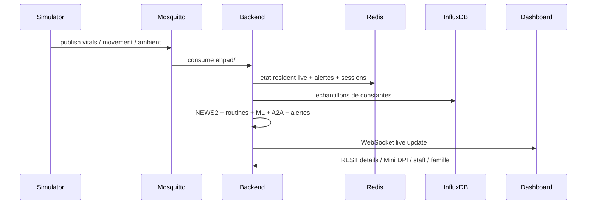
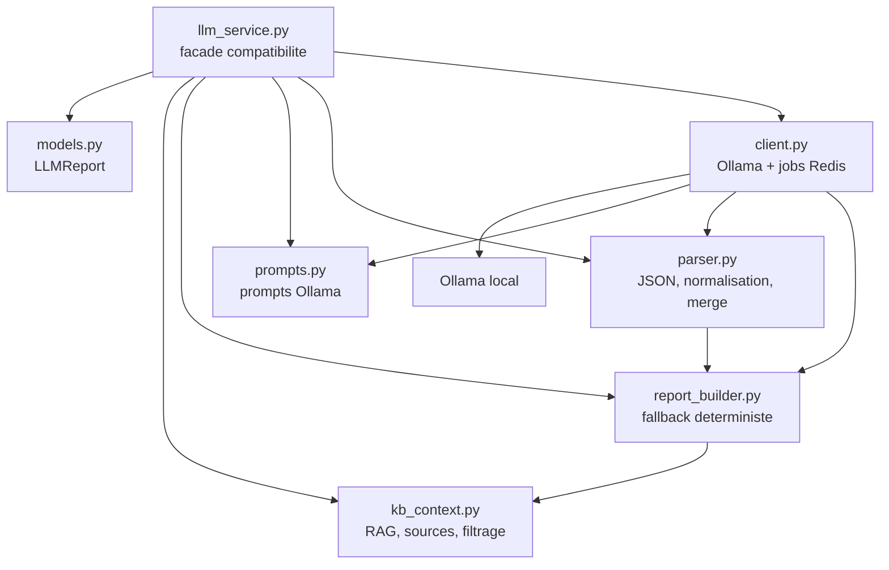

# Architecture technique - HEPAD Monitor

## Vue D'ensemble

Le projet est un monolithe modulaire FastAPI + dashboard HTML/JS + simulateur
MQTT, orchestre par Docker Compose. Le LLM est optionnel et tourne via Ollama
local sur la machine hote.

```mermaid
flowchart LR
    SIM[Simulator Python<br/>25 residents]
    MQTT[Broker Mosquitto<br/>MQTT 1883 / WS 9001]
    API[Backend FastAPI<br/>API + WebSocket + alertes + ML]
    REDIS[(Redis<br/>etat live + sessions + caches)]
    INF[(InfluxDB<br/>historique capteurs)]
    DASH[Dashboard HTML/JS<br/>port 3002]
    STAFF[App soignant mobile]
    FAMILY[Espace famille]
    LLMAPP[Services LLM modulaires<br/>app/services/llm]
    OLLAMA[Ollama local<br/>llama3.2 + qwen2.5 + meditron]

    SIM -->|vitals QoS1<br/>ambient QoS0<br/>critical QoS2| MQTT
    MQTT --> API
    API --> REDIS
    API --> INF
    API --> LLMAPP
    LLMAPP --> OLLAMA
    DASH -->|REST /api| API
    DASH -->|WebSocket /ws| API
    STAFF --> DASH
    FAMILY --> DASH
```



## Services Docker

| Service | Role | Exposition locale |
|---|---|---|
| `backend` | FastAPI, MQTT consumer, alertes, ML, WebSocket | `localhost:8001` |
| `dashboard` | UI soignant/famille/mobile, proxy API | `localhost:3002`, `localhost:3443` |
| `simulator` | publication MQTT de constantes et capteurs | interne |
| `mosquitto` | broker MQTT avec comptes et ACL | `127.0.0.1:1883`, `127.0.0.1:9001` |
| `redis` | etat courant, sessions, caches, audits | `127.0.0.1:6379` |
| `influxdb` | historique de constantes | `127.0.0.1:8086` |
| `llm_worker` | rapports LLM quotidiens | interne |

Ollama n'est pas un service Compose dans la demo actuelle. Le backend appelle
`http://host.docker.internal:11434`.

## Flux Temps Reel



## Backend

Le backend reste deploye comme un seul service FastAPI, mais le code est
organise par modules.

```text
backend/
|-- main.py                         # orchestration legacy FastAPI/MQTT/WS
|-- llm_service.py                  # facade de compatibilite LLM
|-- alert_engine.py                 # moteur alertes 5 niveaux + NEWS2
|-- ml_model.py                     # GradientBoostingClassifier
|-- a2a_agents.py                   # synthese agentique
|-- auth.py                         # sessions famille et staff
|-- history_injector.py             # injection historique InfluxDB
|-- app/
|   |-- api/routers/                # routes FastAPI extraites
|   |-- core/                       # config, middleware, runtime
|   |-- db/                         # clients Redis / InfluxDB
|   |-- domain/                     # readiness, residents, scenarios, mapping KB
|   `-- services/
|       |-- llm/                    # LLM decoupe par responsabilite
|       |-- llm_report_service.py
|       |-- patient_files_service.py
|       |-- push_service.py
|       |-- scalability_service.py
|       `-- scheduler_service.py
|-- kb/
`-- requirements.txt
```

## Architecture LLM

`backend/llm_service.py` est une facade courte. Elle conserve les imports
historiques utilises par le backend et les tests, tandis que la logique est dans
`backend/app/services/llm/`.



Principes:

- le LLM ne decide pas les alertes;
- le fallback deterministe produit toujours un rapport minimal;
- la KB et les sources filtrent ce que le LLM peut citer;
- `client.py` est le seul module LLM qui fait de l'I/O reseau;
- les exports historiques restent disponibles depuis `llm_service.py`.

## Donnees Et Persistance

| Stockage | Usage |
|---|---|
| Redis | etat resident courant, alertes, sessions famille/staff, caches LLM, audits |
| InfluxDB | series temporelles des constantes vitales |
| `data/patients/` | profils modifiables, historiques generes et fichiers demo |
| `backend/kb/` | base de connaissances clinique et validations KB |

## Securite Demo

- `.env` n'est pas versionne.
- `dashboard/certs/` est ignore par Git et contient uniquement des certificats
  locaux de developpement.
- Redis et Mosquitto sont proteges par mots de passe/ACL dans Docker Compose.
- Les ports MQTT, Redis et InfluxDB sont exposes uniquement sur `127.0.0.1`.
- `fastapi`, `pydantic` et `starlette` sont epingles sur des versions corrigees
  apres audit de dependances.
- `python-multipart` est mis a jour en `0.0.26`.
- `scikit-learn` est mis a jour en `1.5.0`.
- Le hash MD5 de l'injecteur historique a ete remplace par SHA-256.

Limites pre-production:

- plusieurs endpoints sensibles doivent encore etre durcis par auth staff;
- WebSocket doit etre authentifie en production;
- TLS MQTT 8883 n'est pas active dans la demo locale;
- les identifiants demo visibles dans le dashboard doivent etre retires en
  environnement reel.

## Tests Et Validation

Etat pre-rendu valide:

- 120 fonctions de test Python;
- 144 cas Pytest collectes et executes;
- `144 passed, 2 warnings`;
- backend Docker reconstruit et `healthy`;
- `/health` retourne `ok` avec 25 residents;
- `pip-audit -r requirements.txt`: aucune vulnerabilite connue;
- Trivy cible `backend/requirements.txt`: 0 HIGH / CRITICAL;
- Bandit: 0 High / 0 Medium, seulement des Low;
- benchmark jury valide autour de 120 msg/s cible.

Commandes de verification:

```bash
docker compose up --build -d
docker compose ps
py -m pip install -r backend/requirements-dev.txt
py -m pytest tests -q
```

Scans securite:

```bash
docker run --rm -v "${PWD}:/repo" zricethezav/gitleaks:latest detect --source=/repo --verbose --no-git
docker run --rm -v "${PWD}:/repo" aquasec/trivy:latest fs /repo --severity CRITICAL,HIGH --no-progress
```
